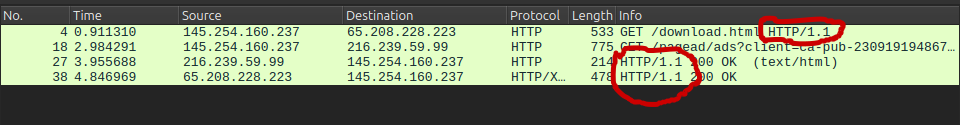
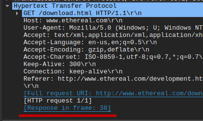

# Analisa file http.cap dengan wireshark

### 1. Versi HTTP yang digunakan

Untuk mengidentifikasi versi HTTP yang digunakan, kita perlu mencari paket yang mengandung HTTP request (seperti GET atau POST) atau HTTP response (seperti 200 OK) terlebih dahulu. Hal ini dapat dilakukan dengan menggunakan filter http di Wireshark. Setelah itu, versi HTTP yang digunakan dapat dilihat pada kolom Info atau di bagian Hypertext Transfer Protocol di Packet Details.

Pada gambar di atas, versi HTTP yang digunakan dapat dilihat pada kolom Info di beberapa paket:

- Pada paket nomor 4, tertulis: `GET /download.html HTTP/1.1`.
- Pada paket nomor 27 dan 38, tertulis: `HTTP/1.1 200 OK`.

Dengan demikian, dapat disimpulkan bahwa komunikasi HTTP tersebut menggunakan versi **`HTTP/1.1`**.

---

### 2. IP address dari client dan server

Dalam komunikasi HTTP, client bertindak sebagai pihak yang mengirim permintaan (request) ke server, sedangkan server bertugas merespons permintaan tersebut. Oleh karena itu, pada HTTP request, client akan menjadi source (sumber) dan server akan menjadi destination (tujuan). Sebaliknya, pada HTTP response, server akan menjadi source karena mengirim respons, dan client akan menjadi destination karena menerima respons.

Berdasarkan gambar yang ada pada nomor 1:

Pada paket nomor 4, client dengan alamat IP `145.254.160.237` mengirim request `GET /download.html HTTP/1.1` ke server dengan alamat IP `65.208.228.223`. Di sini, client bertindak sebagai source karena mengirim request, sedangkan server bertindak sebagai destination karena menerima request. Kemudian, pada paket nomor 38, server (`65.208.228.223`) mengirim respons `HTTP/1.1 200 OK` kembali ke client (`145.254.160.237`). Di sini, server bertindak sebagai source karena mengirim respons, dan client bertindak sebagai destination karena menerima respons.

Selain itu, terdapat komunikasi dengan server lain, yaitu pada paket nomor 18 dan 27. Pada paket nomor 18, client (`145.254.160.237`) mengirim request `GET /pagead/ads?client=ca-pub-230919194867...` ke server dengan alamat IP `216.239.59.99`. Server ini kemungkinan besar adalah server penyedia iklan, karena alamat IP `216.239.59.99` termasuk dalam rentang IP yang dimiliki oleh Google, yang sering digunakan untuk layanan iklan seperti Google Ads. Pada paket nomor 27, server iklan (`216.239.59.99`) mengirim respons `HTTP/1.1 200 OK (text/html)` kembali ke client (`145.254.160.237`).

Dengan demikian, dapat disimpulkan bahwa:

- IP address client: **`145.254.160.237`**
- IP address server utama: **`65.108.228.223`**
- IP address server iklan: **`216.239.59.99`**

---

### 3. Waktu client mengirim request

Untuk mengetahui waktu client mengirim request, kita perlu melihat paket yang mengandung HTTP request (misalnya, GET atau POST).

Berdasarkan gambar yang ada pada nomor 1:

Pada paket nomor 4, client (`145.254.160.237`) mengirim request `GET /download.html HTTP/1.1` ke server (`65.208.228.223`). Waktu pengiriman request ini dapat dilihat di kolom Time pada Wireshark.

Waktu yang tertera pada paket nomor 4 adalah `0.911310` detik. Dengan demikian, waktu client mengirim request adalah **`0.911310`** detik.

---

### 4. Waktu server menerima HTTP request dari client

Untuk mengetahui waktu server menerima HTTP request dari client, kita perlu mencari paket HTTP response yang sesuai dengan request tersebut. Caranya adalah dengan membuka paket HTTP request yang dikirim oleh client dan melihat informasi respons yang terkait. Pertama, klik dua kali pada paket HTTP request untuk membuka Packet Details. Kemudian, buka bagian Hypertext Transfer Protocol dan cari informasi "Response In: Frame [nomor paket]". Informasi ini menunjukkan paket yang berisi respons dari server terhadap request yang dikirim oleh client.

Berdasarkan gambar nomor 1 :

Buka Packet Details dari paket nomor 4 dan lihat pada bagian Hypertext Transfer Protocol untuk enemukan informasi tentang respons dari paket tersebut.

Pada gambar di atas, terlihat bahwa HTTP response dari request paket nomor 4 adalah paket nomor 38. Waktu yang tertera pada paket nomor 38 adalah `4.846969` detik. Dengan demikia waktu client mengirim request adalah **`4.846969`** detik.

---

### 5. waktu yang dibutuhkan untuk transfer dan response dari client ke server
