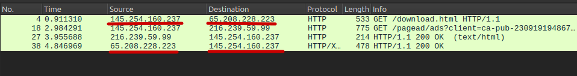
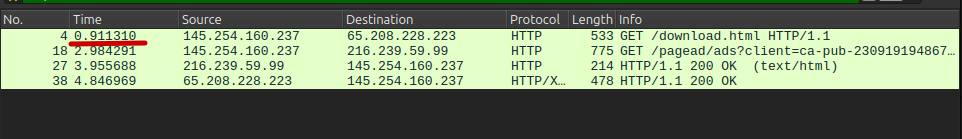
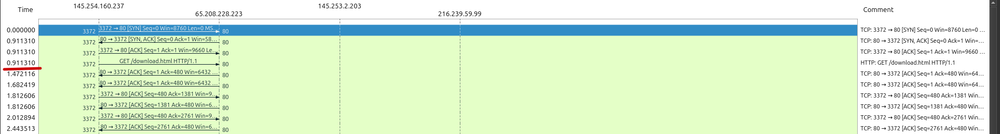
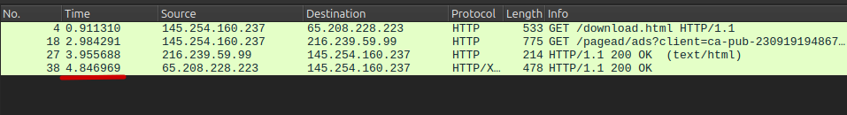
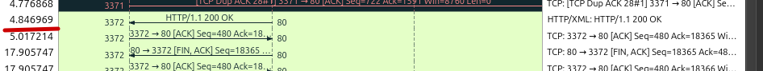
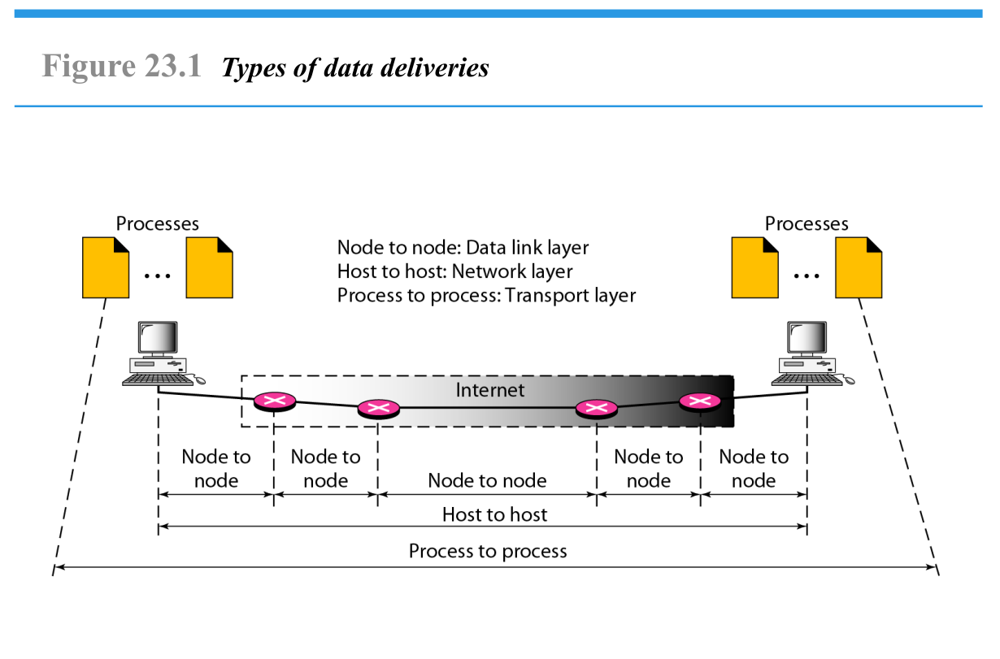
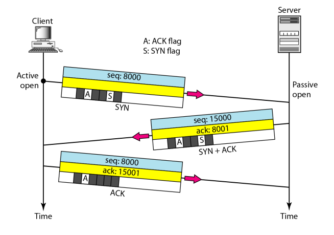
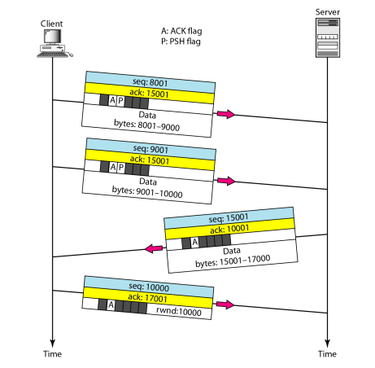

<h1 align="center">
  Tugas 1: Reviu
</h1>

<br>

## Nomor 1: Analisa file http.cap dengan wireshark

Download http.cap di [http.cap](https://wiki.wireshark.org/SampleCaptures)

### 1. Versi HTTP yang digunakan

Untuk mengidentifikasi versi HTTP yang digunakan, kita perlu mencari paket yang mengandung HTTP request (seperti GET atau POST) atau HTTP response (seperti 200 OK) terlebih dahulu. Hal ini dapat dilakukan dengan menggunakan filter http di Wireshark. Setelah itu, versi HTTP yang digunakan dapat dilihat pada kolom Info atau di bagian Hypertext Transfer Protocol di Packet Details.


Pada gambar di atas, versi HTTP yang digunakan dapat dilihat pada kolom Info di beberapa paket:

- Pada paket nomor 4, tertulis: `GET /download.html HTTP/1.1`.
- Pada paket nomor 27 dan 38, tertulis: `HTTP/1.1 200 OK`.

Dengan demikian, dapat disimpulkan bahwa komunikasi HTTP tersebut menggunakan versi **`HTTP/1.1`**.

### 2. IP address dari client dan server

Dalam komunikasi HTTP, client bertindak sebagai pihak yang mengirim permintaan (request) ke server, sedangkan server bertugas merespons permintaan tersebut. Oleh karena itu, pada HTTP request, client akan menjadi source (sumber) dan server akan menjadi destination (tujuan). Sebaliknya, pada HTTP response, server akan menjadi source karena mengirim respons, dan client akan menjadi destination karena menerima respons.



Pada paket nomor 4, client dengan alamat IP `145.254.160.237` mengirim request `GET /download.html HTTP/1.1` ke server dengan alamat IP `65.208.228.223`. Di sini, client bertindak sebagai source karena mengirim request, sedangkan server bertindak sebagai destination karena menerima request. Kemudian, pada paket nomor 38, server (`65.208.228.223`) mengirim respons `HTTP/1.1 200 OK` kembali ke client (`145.254.160.237`). Di sini, server bertindak sebagai source karena mengirim respons, dan client bertindak sebagai destination karena menerima respons.

Selain itu, terdapat komunikasi dengan server lain, yaitu pada paket nomor 18 dan 27. Pada paket nomor 18, client (`145.254.160.237`) mengirim request `GET /pagead/ads?client=ca-pub-230919194867...` ke server dengan alamat IP `216.239.59.99`. Server ini kemungkinan besar adalah server penyedia iklan, karena alamat IP `216.239.59.99` termasuk dalam rentang IP yang dimiliki oleh Google, yang sering digunakan untuk layanan iklan seperti Google Ads. Pada paket nomor 27, server iklan (`216.239.59.99`) mengirim respons `HTTP/1.1 200 OK (text/html)` kembali ke client (`145.254.160.237`).

Dengan demikian, dapat disimpulkan bahwa:

- IP address client: **`145.254.160.237`**
- IP address server: **`65.108.228.223`**
- IP address server iklan: **`216.239.59.99`**

### 3. Waktu client mengirim HTTP request ke server

Untuk mengetahui waktu client mengirim request, kita perlu melihat paket yang mengandung HTTP request (misalnya, GET atau POST).




Pada paket nomor 4, client (`145.254.160.237`) mengirim request `GET /download.html HTTP/1.1` ke server (`65.208.228.223`). Waktu pengiriman request ini dapat dilihat di kolom Time pada Wireshark.

Waktu yang tertera pada paket nomor 4 adalah `0.911310` detik. Dengan demikian, waktu client mengirim request adalah **`0.911310`** detik.

### 4. Waktu server mengirim HTTP response dari client

Untuk mengetahui waktu server menerima HTTP request dari client, kita perlu mencari paket HTTP response yang sesuai dengan request tersebut. Caranya adalah dengan membuka paket HTTP request yang dikirim oleh client dan melihat informasi respons yang terkait. Pertama, klik dua kali pada paket HTTP request untuk membuka Packet Details. Kemudian, buka bagian Hypertext Transfer Protocol dan cari informasi "Response In Frame: [nomor paket]". Informasi ini menunjukkan paket yang berisi respons dari server terhadap request yang dikirim oleh client.

Buka Packet Details dari paket nomor 4 (HTTP request) dan lihat pada bagian Hypertext Transfer Protocol untuk menemukan informasi tentang respons dari paket tersebut.





Pada gambar di atas, terlihat bahwa HTTP response dari request paket nomor 4 adalah paket nomor 38. Waktu yang tertera pada paket nomor 38 adalah `4.846969` detik. Dengan demikian waktu server menerima request adalah **`4.846969`** detik.

### 5. Waktu yang dibutuhkan untuk transfer dan response dari client ke server

Untuk menghitung waktu yang dibutuhkan dari client mengirim request hingga server memberikan respons, kita perlu menghitung selisih waktu antara paket request dan paket response.

- Waktu client mengirim request: `0.911310` detik (paket nomor 4).

- Waktu server mengirim respons: `4.846969` detik (paket nomor 38).

Selisih waktu:

```bash
Waktu respons - Waktu request = 4.846969 - 0.911310 = 3.935659 detik
```

Dengan demikian, waktu yang dibutuhkan untuk transfer dan response dari client ke server adalah **`3.935659`** detik.

---

<br>

## Nomor 2: Analisis Gambar



Gambar tersebut menunjukkan berbagai jenis pengiriman data dalam jaringan berdasarkan lapisan model OSI. Berikut adalah penjelasan dari proses yang terjadi dalam gambar:

### 1. Node to Node: Data link layer

Komunikasi ini terjadi ketika dua perangkat dalam satu jaringan yang sama saling bertukar data, seperti komputer yang terhubung ke switch atau router. Data dikirim dalam bentuk frame dan menggunakan alamat fisik (MAC address) untuk memastikan sampai ke perangkat tujuan. Jika ada gangguan atau kesalahan dalam pengiriman, sistem akan mendeteksi dan memperbaikinya jika memungkinkan. Contohnya, ketika kita mengakses file di komputer lain dalam jaringan Wi-Fi rumah, data akan dikirim antar perangkat di Data Link Layer.

### 2. Host to Host: Network layer

Ketika dua perangkat berada di jaringan yang berbeda (misalnya, komputer kita mengakses server di internet), data harus melewati beberapa perangkat perantara seperti router. Dalam tahap ini, data dikemas dalam bentuk paket dan diberi alamat IP agar bisa dikirim ke perangkat tujuan yang benar. Router berperan dalam menentukan jalur terbaik bagi data agar sampai ke tujuan dengan efisien. Proses komunikasi ini terjadi di Network Layer, yang menangani perutean data di jaringan luas seperti internet.

### 3. Process to Process: Transport layer

Setelah data sampai ke perangkat tujuan, komunikasi harus diarahkan ke aplikasi yang benar. Misalnya, jika kita sedang membuka browser sambil mendengarkan musik online, data dari internet harus sampai ke aplikasi yang sesuai (browser untuk website, media player untuk musik). Untuk mengatur ini, sistem menggunakan nomor port, sehingga data bisa dikirim ke aplikasi yang tepat. Protokol TCP memastikan data dikirim secara lengkap dan berurutan (seperti dalam pengiriman email atau unduhan file), sedangkan UDP lebih cepat tetapi tidak menjamin keutuhan data (digunakan untuk streaming video atau game online). Komunikasi ini berlangsung di Transport Layer.

---

<br>

## Nomor 3: Rangkuman tahapan komunikasi menggunakan TCP

TCP adalah protokol komunikasi yang handal, berorientasi koneksi, dan memastikan pengiriman data secara terurut dan bebas kesalahan. Proses komunikasi TCP terdiri dari tiga tahap utama:

### 1. Connection establishment using three-way handshaking



Proses ini digunakan untuk membangun koneksi antara dua perangkat (klien dan server) sebelum pertukaran data dimulai. Tahapannya adalah:

- Langkah 1 (SYN): Klien mengirimkan paket SYN (Synchronize) ke server. Paket ini berisi nomor urut acak (sequence number) yang akan digunakan selama komunikasi.
- Langkah 2 (SYN-ACK): Server merespons dengan paket SYN-ACK (Synchronize-Acknowledge). Paket ini berisi:
  - ACK (Acknowledgment): Konfirmasi bahwa server menerima paket SYN dari klien.
  - SYN: Permintaan sinkronisasi dari server ke klien dengan nomor urut acak milik server.
- Langkah 3 (ACK): Klien mengirimkan paket ACK (Acknowledge) ke server untuk mengonfirmasi bahwa koneksi telah terbentuk.

Setelah tiga langkah ini, koneksi TCP terbentuk dan siap untuk pertukaran data.

### 2. Data transfer



Setelah koneksi terbentuk, data dapat dikirim antara klien dan server. Proses ini melibatkan:

- Data dibagi menjadi segmen-segmen kecil yang dikirim secara berurutan.
- Setiap segmen memiliki sequence number untuk memastikan urutan pengiriman.
- Penerima mengirim ACK (Acknowledgment) untuk setiap segmen yang berhasil diterima.
- Jika ada segmen yang hilang atau rusak, pengirim akan mengirim ulang segmen tersebut.
- Flow Control digunakan untuk mengontrol laju pengiriman data agar sesuai dengan kemampuan penerima.
- Error Detection memastikan data yang dikirim bebas dari kesalahan.

### 3. Connection termination using four-way handshaking


Proses ini digunakan untuk menutup koneksi TCP setelah pertukaran data selesai. Karena koneksi TCP bersifat full-duplex (data dapat mengalir dalam dua arah secara independen), penutupan koneksi dilakukan dalam empat langkah:

- Langkah 1 (FIN): Salah satu pihak (misalnya, klien) mengirim paket FIN (Finish) ke pihak lain (server) untuk menandakan bahwa ia ingin menutup koneksi dari arahnya.
- Langkah 2 (ACK): Pihak yang menerima FIN (server) mengirim paket ACK (Acknowledge) untuk mengonfirmasi penerimaan permintaan penutupan.
- Langkah 3 (FIN): Server mengirim paket FIN ke klien untuk menutup koneksi dari arahn
- Langkah 4 (ACK): Klien mengirim paket ACK ke server untuk mengonfirmasi penutupan koneksi.

Setelah ini, koneksi TCP ditutup sepenuhnya.

### Ringkasan

1. **Three-way Handshake**: Membangun koneksi TCP.
2. **Data Transfer**: Mengirim data secara terurut dan handal.
3. **Four-way Handshake**: Menutup koneksi TCP.
