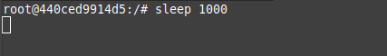
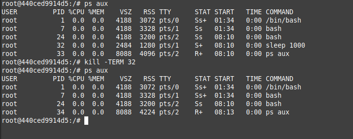
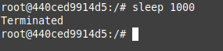
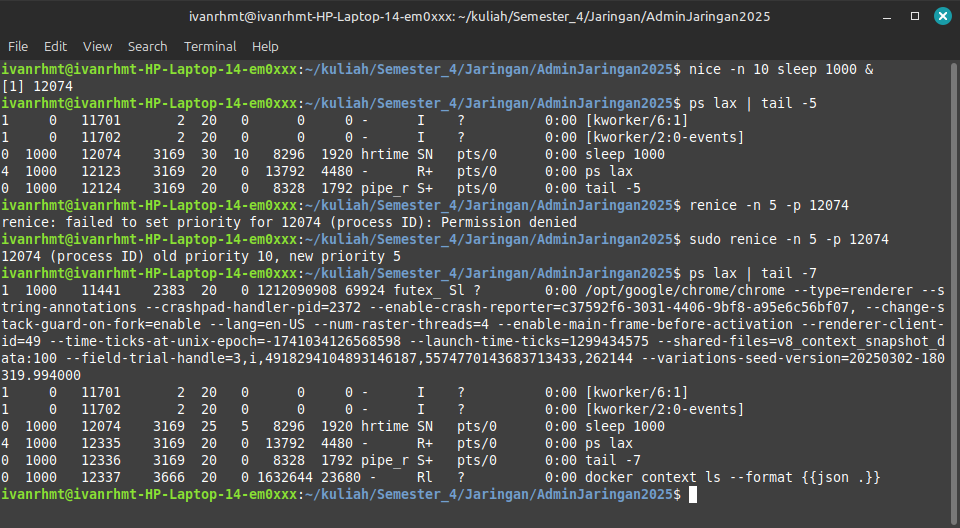
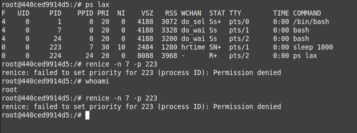
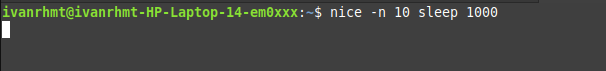
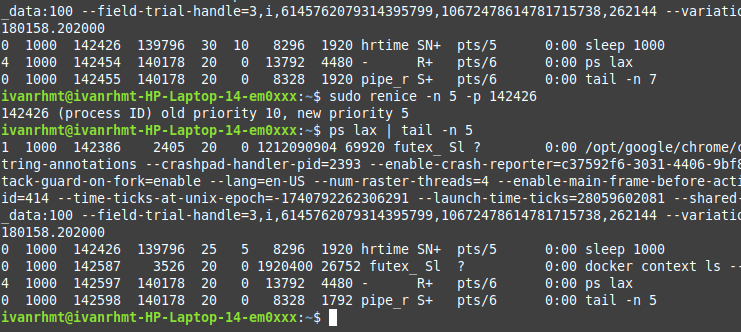

<h1 align="center">
  Chapter 4: Process Control
</h1>

<br>

## Komponen dalam sebuah proses

Sebuah proses dalam sistem operasi terdiri dari dua bagian utama, yaitu **address space** (ruang memori yang digunakan untuk menyimpan kode, data, dan stack program) dan **struktur data kernel** (yang menyimpan informasi seperti status proses, prioritas, dan sumber daya yang digunakan). Proses ini berfungsi sebagai wadah yang mengelola semua sumber daya yang diperlukan untuk menjalankan sebuah program, seperti memori, file yang dibuka, dan atribut lainnya.

### Thread

Thread adalah unit eksekusi yang berjalan di dalam sebuah proses. Sebuah proses dapat memiliki banyak thread, dan semua thread tersebut berbagi ruang memori dan sumber daya yang sama. Thread memungkinkan program untuk melakukan banyak tugas secara paralel, dan karena lebih ringan dibandingkan proses, pembuatan dan penghapusannya lebih efisien.

### PID (Process ID)

Setiap proses memiliki PID (Process ID) yang unik, yaitu nomor identifikasi yang diberikan oleh kernel saat proses dibuat. PID ini digunakan untuk mengidentifikasi proses dalam berbagai operasi sistem, seperti mengirim sinyal atau memantau proses.

### Namespaces

Namespaces adalah fitur yang memungkinkan beberapa proses memiliki PID yang sama tetapi dalam lingkungan yang terisolasi. Ini digunakan dalam teknologi container, di mana setiap container memiliki lingkungannya sendiri yang terpisah, memungkinkan beberapa aplikasi berjalan secara independen di sistem yang sama.

### PPID (Parent Process ID)

PPID (Parent Process ID) adalah PID dari proses induk yang membuat proses tersebut. Setiap proses (kecuali proses utama sistem) memiliki proses induk, dan PPID membantu sistem melacak hubungan hierarkis antara proses.

### UID (User ID) dan EUID (Effective User ID)

- UID (User ID) adalah ID pengguna yang menjalankan proses.
- EUID (Effective User ID) adalah ID yang digunakan oleh proses untuk menentukan izin akses ke sumber daya seperti file, port jaringan, atau operasi sistem lainnya. EUID ini memastikan bahwa proses hanya dapat mengakses sumber daya yang diizinkan.

## Lifecycle suatu proses

Untuk membuat proses baru, sebuah proses menggunakan system call fork untuk menyalin dirinya sendiri. fork menghasilkan proses anak yang identik dengan proses induk, tetapi memiliki PID yang berbeda. Pada Linux, fork sebenarnya memanggil clone, yang lebih canggih dan mendukung thread. Saat sistem boot, kernel membuat beberapa proses secara otomatis, termasuk init atau systemd (PID 1), yang bertanggung jawab menjalankan skrip startup. Semua proses lain adalah turunan dari proses utama ini.

### Signals

Signals adalah notifikasi yang dikirim ke proses untuk memberi tahu terjadinya suatu peristiwa. Ada sekitar 30 jenis signal, digunakan untuk berbagai tujuan seperti komunikasi antar proses, menghentikan proses, atau memberi tahu kondisi tertentu.


Beberapa signal penting termasuk:

- **KILL**: Menghentikan proses secara paksa (tidak bisa diabaikan).
- **INT**: Dikirim saat <CTRL-C> ditekan, meminta proses berhenti.
- **TERM**: Meminta proses berhenti dengan bersih.
- **HUP**: Biasanya digunakan untuk meminta daemon restart.
- **QUIT**: Mirip TERM, tetapi menghasilkan core dump jika tidak ditangani.

### kill: mengirim signals

Perintah kill digunakan untuk mengirim signal ke proses. Secara default, kill mengirimkan signal TERM. Sintaksnya adalah:

```bash
kill [-signal] pid
```

- `[-signal]`(opsional) adalah sinyal yang ingin dikirim ke proses. Sinyal dapat ditulis dalam bentuk angka(misalnya, `-9` untuk KILL) atau nama sinyal(misalnya, `-TERM`). Jika tidak ada sinyal yang ditentukan, secara default `kill` mengirimkan sinyal TERM (terminate), yang meminta proses untuk berhenti dengan bersih.
- `pid` adalah Proses ID(PID) dari proses yang menjadi target. PID dapat ditemukan menggunakan perintah seperti `ps`, `top`, atau `htop`.

`killall` dan `pkill` adalah alternatif untuk menghentikan proses berdasarkan nama atau pengguna.

```bash
killall firefox  # Menghentikan semua proses Firefox
pkill -u abdoufermat  # Menghentikan semua proses milik pengguna abdoufermat
```

## PS: memantau proses

Perintah ps adalah alat utama administrator sistem untuk memantau proses. Meskipun versi ps berbeda dalam argumen dan tampilannya, semua memberikan informasi yang serupa. ps dapat menampilkan PID, UID, prioritas, terminal kontrol, penggunaan memori, konsumsi CPU, dan status proses (seperti running, stopped, atau sleeping).

Untuk mendapatkan gambaran umum sistem, jalankan ps aux. Opsi a menampilkan proses semua pengguna, u memberikan informasi detail, dan x menampilkan proses yang tidak terhubung ke terminal. Contoh:

```bash
$ ps aux | head -8
USER       PID %CPU %MEM    VSZ   RSS TTY      STAT START   TIME COMMAND
root         1  0.0  0.0  22556  2584 ?        Ss   2019   0:02 /sbin/init
root         2  0.0  0.0      0     0 ?        S    2019   0:00 [kthreadd]
root         3  0.0  0.0      0     0 ?        I<   2019   0:00 [rcu_gp]
root         4  0.0  0.0      0     0 ?        I<   2019   0:00 [rcu_par_gp]
root         6  0.0  0.0      0     0 ?        I<   2019   0:00 [kworker/0:0H-kblockd]
root         8  0.0  0.0      0     0 ?        I<   2019   0:00 [mm_percpu_wq]
root         9  0.0  0.0      0     0 ?        S    2019   0:00 [ksoftirqd/0]
```


Opsi lain yang berguna adalah lax, yang memberikan informasi teknis lebih rinci tentang proses. lax lebih cepat daripada aux karena tidak perlu mengurai nama pengguna dan grup. Contoh:

```bash
$ ps lax | head -8
F   UID   PID  PPID PRI  NI    VSZ   RSS WCHAN  STAT TTY        TIME COMMAND
4     0     1     0  20   0  22556  2584 -      Ss   ?          0:02 /sbin/init
1     0     2     0  20   0      0     0 -      S    ?          0:00 [kthreadd]
1     0     3     2  20   0      0     0 -      I<   ?          0:00 [rcu_gp]
1     0     4     2  20   0      0     0 -      I<   ?          0:00 [rcu_par_gp]
1     0     6     2  20   0      0     0 -      I<   ?          0:00 [kworker/0:0H-kblockd]
1     0     8     2  20   0      0     0 -      I<   ?          0:00 [mm_percpu_wq]
1     0     9     2  20   0      0     0 -      S    ?          0:00 [ksoftirqd/0]
```

Untuk mencari proses tertentu, gunakan grep untuk menyaring output ps. Contoh:

```bash
$ ps aux | grep -v grep | grep firefox
```

Untuk menentukan PID suatu proses, gunakan pgrep atau pidof. Contoh:

```bash
$ pgrep firefox
$ pidof /usr/bin/firefox
```

## Pemantauan Interaktif menggunakan top

Perintah top memberikan tampilan real-time yang dinamis dari sistem yang sedang berjalan. top menampilkan informasi ringkasan sistem serta daftar proses atau thread yang sedang dikelola oleh kernel Linux. Informasi yang ditampilkan, seperti jenis, urutan, dan ukuran data, dapat dikonfigurasi oleh pengguna dan disimpan agar tetap berlaku setelah restart. Secara default, tampilan top diperbarui setiap 1-2 detik, tergantung pada sistem.

Ada juga perintah htop, yang merupakan alat pemantau proses interaktif untuk sistem Unix. htop adalah aplikasi berbasis teks (untuk konsol atau terminal X) dan memerlukan ncurses. htop mirip dengan top, tetapi memungkinkan pengguna untuk menggulir secara vertikal dan horizontal, sehingga semua proses yang berjalan di sistem dapat dilihat, termasuk command line lengkapnya. htop juga memiliki antarmuka pengguna yang lebih baik dan lebih banyak opsi untuk operasi.

## Nice and Renice: Mengubah Prioritas Proses

Niceness adalah nilai numerik yang memberikan petunjuk kepada kernel tentang bagaimana suatu proses harus diperlakukan relatif terhadap proses lain yang bersaing untuk mendapatkan CPU. Nilai niceness yang tinggi berarti prioritas proses rendah (proses bersikap "baik"), sedangkan nilai rendah atau negatif berarti prioritas tinggi (proses tidak terlalu "baik"). Rentang nilai niceness bervariasi antar sistem, misalnya di Linux rentangnya adalah -20 hingga +19.

Proses dengan prioritas rendah akan mendapatkan waktu CPU lebih sedikit dibandingkan proses dengan prioritas tinggi. Misalnya, jika Anda menjalankan tugas yang intensif CPU di latar belakang, Anda dapat memulainya dengan nilai niceness tinggi agar tidak mengganggu proses lain.

Perintah nice digunakan untuk memulai proses dengan nilai niceness tertentu. Sintaksnya:

```bash
nice -n nice_val [command]

# Contoh
nice -n 10 sh infinite.sh &
```

Perintah renice digunakan untuk mengubah nilai niceness proses yang sedang berjalan. Sintaksnya:

```bash
renice -n nice_val -p pid

# Contoh
renice -n 10 -p 1234
```

Priority value adalah nilai prioritas sebenarnya yang digunakan kernel Linux untuk menjadwalkan tugas. Di Linux, rentang prioritas adalah 0 hingga 139, di mana 0-99 untuk tugas real-time dan 100-139 untuk pengguna. Hubungan antara nilai nice dan priority adalah:

> priotiry_value = 20 + nice_value

Nilai nice default adalah 0. Semakin rendah nilai nice, semakin tinggi prioritas proses.

## The /proc Filesystem

Direktori /proc adalah sebuah pseudo-filesystem di Linux yang digunakan oleh kernel untuk mengekspos berbagai informasi tentang status sistem, termasuk status proses. Meskipun namanya merujuk pada "process", /proc juga berisi informasi lain seperti statistik sistem.

Setiap proses direpresentasikan oleh direktori di /proc yang dinamai sesuai dengan PID-nya. Setiap direktori proses berisi berbagai file yang menyediakan informasi detail tentang proses tersebut, seperti command line, environment variables, file descriptors, dan lainnya. Tools seperti ps dan top membaca informasi status proses dari direktori /proc ini. Dengan demikian, /proc merupakan sumber informasi penting untuk memantau dan memahami proses serta kondisi sistem secara keseluruhan.


## Strace and Truss

Untuk memahami aktivitas suatu proses, strace di Linux atau truss di FreeBSD dapat digunakan. Perintah ini melacak system calls dan signals yang dilakukan oleh proses. Alat ini berguna untuk debugging program atau menganalisis perilaku suatu program.

Contoh penggunaan strace pada proses top (dengan PID 5810):

```bash
$ strace -p 5810

gettimeofday({1197646605,  123456}, {300, 0}) = 0
open("/proc", O_RDONLY|O_NONBLOCK|O_LARGEFILE|O_DIRECTORY) = 7
fstat64(7, {st_mode=S_IFDIR|0555, st_size=0, ...}) = 0
fcntl64(7, F_SETFD, FD_CLOEXEC)          = 0
getdents64(7, /* 3 entries */, 32768)   = 72
getdents64(7, /* 0 entries */, 32768)   = 0
stat64("/proc/1", {st_mode=S_IFDIR|0555, st_size=0, ...}) = 0
open("/proc/1/stat", O_RDONLY)           = 8
read(8, "1 (init) S 0 1 1 0 -1 4202752"..., 1023) = 168
close(8)                                = 0

[...]
```

Output yang dihasilkan menampilkan berbagai system calls, seperti membaca waktu saat ini, membuka direktori /proc, dan membaca file /proc/1/stat untuk mendapatkan informasi tentang proses init. Dengan strace atau truss, aktivitas proses dapat dianalisis secara mendetail.

## Runaway processes

Proses yang tidak merespons sistem dan berjalan di luar kendali disebut runaway processes. Proses ini mengabaikan prioritas penjadwalan dan menggunakan 100% CPU, menyebabkan sistem menjadi lambat. Untuk menghentikan proses tersebut, perintah kill dapat digunakan. Jika proses tidak merespons sinyal TERM, sinyal KILL dapat digunakan untuk memaksa penghentian. Contoh:

```bash
kill -9 pid

atau

kill -KILL pid
```

Untuk menyelidiki penyebab runaway process, alat seperti strace atau truss dapat digunakan. Jika proses menghasilkan output yang berlebihan, hal ini dapat memenuhi filesystem. Perintah df -h digunakan untuk memeriksa penggunaan filesystem, dan du digunakan untuk menemukan file atau direktori terbesar.

Selain itu, perintah lsof dapat digunakan untuk melihat file yang dibuka oleh proses tersebut. Contoh:

```bash
lsof -p pid
```

## Periodic Processes

### cron: menjadwalkan perintah

cron adalah alat tradisional untuk menjalankan perintah pada jadwal yang telah ditentukan. cron berjalan saat sistem boot dan terus beroperasi selama sistem aktif. cron membaca file konfigurasi (disebut crontab) yang berisi daftar perintah dan waktu eksekusinya. Perintah dijalankan menggunakan shell (sh), sehingga hampir semua perintah yang dapat dijalankan manual dapat dijadwalkan dengan cron.

File crontab disimpan di /var/spool/cron (Linux) atau /var/cron/tabs (FreeBSD). Format crontab terdiri dari lima field untuk menentukan menit, jam, hari, bulan, dan hari dalam minggu, diikuti oleh perintah yang akan dijalankan.

```bash
*     *     *     *     *  perintah yang akan dijalankan
-     -     -     -     -
|     |     |     |     |
|     |     |     |     +----- hari dalam seminggu (0 - 6) (Minggu=0)
|     |     |     +------- bulan (1 - 12)
|     |     +--------- tanggal (1 - 31)
|     +----------- jam (0 - 23)
+------------- menit (0 - 59)
```

Contoh:

```bash
30 2 * * * /path/to/command  # Menjalankan perintah setiap hari pukul 02:30
```

### crontab Management

Perintah crontab digunakan untuk mengelola crontab. Opsi -e untuk mengedit, -l untuk menampilkan, dan -r untuk menghapus crontab.

### Systemd Timer

Systemd timer adalah alternatif modern untuk cron. Timer diaktifkan oleh unit service yang sesuai dan dapat dijadwalkan berdasarkan waktu, boot sistem, atau event tertentu. Perintah systemctl list-timers digunakan untuk menampilkan timer yang aktif. Contoh:

```bash
$ systemctl list-timers

NEXT                         LEFT          LAST                         PASSED       UNIT                         ACTIVATES
Fri 2021-10-15 00:00:00 UTC  1h 1min left Thu 2021-10-14 00:00:00 UTC  22h ago      logrotate.timer              logrotate.service

1 timers listed.
```

File konfigurasi timer (berakhiran .timer) menentukan jadwal dan akurasi eksekusi.

### Penggunaan umum untuk scheduled tasks

1. **Mengirim Email:**
   Menjadwalkan pengiriman email otomatis, seperti laporan harian atau hasil eksekusi perintah. Contoh:

```bash
30 4 25 * * /usr/bin/mail -s "Monthly report"
    abdou@admin.com%Receive the monthly report for the month of July!%%Sincerely,%cron%
```

2. **Membersihkan Filesystem:**
   Menjalankan script untuk menghapus file lama, seperti file di direktori trash. Contoh:

```bash
0 0 * * * /usr/bin/find /home/abdou/.local/share/Trash/files -mtime +30 -exec /bin/rm -f {} \;
```

3. **Rotasi Log File:**
   Memecah file log menjadi segmen berdasarkan ukuran atau tanggal untuk mempertahankan versi lama.

4. **Menjalankan Batch Jobs:**
   Menjadwalkan tugas panjang seperti pemrosesan pesan antrian atau ETL (Extract, Transform, Load).

5. **Backup dan Mirroring:**
   Menjadwalkan backup atau sinkronisasi direktori ke sistem remote menggunakan rsync.

## Percobann

### Mengirim sinyal ke proses


Menjalankan sebuah proses `sleep 1000`.


Memantau proses menggunakan `ps aux` dan mengirim sinyal TERM pada proses dengan PID `32` menggunakan `kill`.


Proses dengan PID `32` berhasil dihentikan dengan bersih.

### Mengubah Prioritas Proses dengan nice dan renice


Menjalankan sebuah proses `sleep 1000` dengan nilai niceness `10`.


Memantau proses menggunakan `ps aux`. Proses yang baru saya jalankan adalah proses dengan PID `223` dan nilai niceness `10`. Nilai niceness yang lebih tinggi ini menunjukkan bahwa proses tersebut memiliki prioritas yang lebih rendah dibandingkan proses lainnya (angka yang lebih besar menunjukkan prioritas yang lebih rendah).

Namun, ketika saya mencoba mengubah nilai niceness menggunakan `renice`, saya mendapatkan pesan error `Permission denied`. Mungkin hal ini terjadi karena menggunakan docker. Meskipun login sebagai root, Docker menggunakan namespace isolation dan cgroups yang membatasi akses penuh ke sistem, mungkin termasuk kemampuan untuk mengubah Niceness proses. Oleh karena itu, saya mencoba melakukan renice di terminal sistem operasi yang saya gunakan yaitu Linux mint.



Pada proses dengan PID `142426` awalnya memiliki nilai niceness `10` dan memiliki nilai prioritas `30`. Ketika melakukan `renice` dengan mengubah nilai niceness menjadi `5` nilai prioritasnya juga berubah menjadi `25`. Nilai prioritas akan naik sebanyak turunnya nilai niceness.