<h1 align="center">
  Instalasi dan Konfigurasi Samba
</h1>

<br>

Pertama, install samba menggunakan perintah seperti berikut:

```bash
sudo apt install samba
```

Setelah itu buat 2 folder yang ingin dijadikan shared folder, yang satu untuk public shared folder dan yang satu lagi untuk limited shared folder.

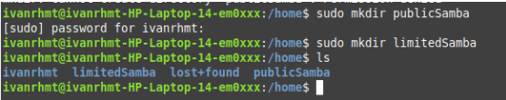

Agar perangkat bisa mengakses folder shared yang dibuat dengan Samba, perangkat tersebut harus berada dalam jaringan yang sama dengan server Samba. Jika tidak, koneksi akan gagal. Pada server Linux tempat Samba berjalan, gunakan perintah berikut untuk melihat alamat IP:

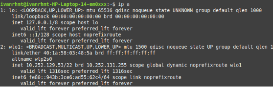

Dari output di atas, alamat IP server adalah "10.252.129.53", namun alamat ini dapat berubah jika koneksi jaringan berubah.

### 1. Membuat public shared folder

Langkah pertama agar foldernya bisa diakses oleh public adalah beri izin akses oleh semua pengguna dengan perintah seperti berikut:

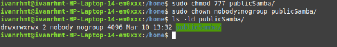

Setelah itu, edit file konfigurasi samba menggunakan perintah:

```bash
sudo nano /etc/samba/smb.conf
```

Tambahkan konfigurasi berikut:

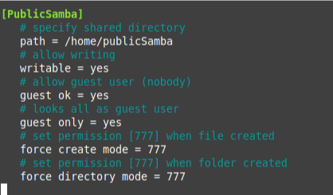

Agar perubahan konfigurasi diterapkan, restart layanan samba dan pastikan samba berjalan dengan baik.

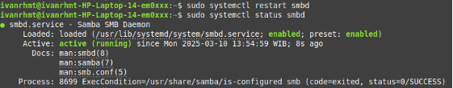

- Akses folder melalui CLI client

  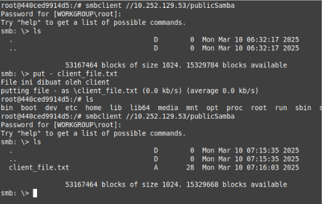

  Dari gambar di atas dapat dilihat bahwa folder publicSamba bisa diakses oleh siapa saja yang berada di koneksi yang sama dengan perintah:

  ```bash
  smbclient //10.252.129.53/publicSamba
  ```

  Client memiliki hak akses penuh terhadap folder tersebut. Seperti, client bisa melihat isi dari direktori, membuat file baru, dan lain sebagainya.

  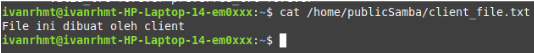

  Server dapat melihat file yang telah dibuat oleh client.

- Akses folder melalui linux client via file manager

  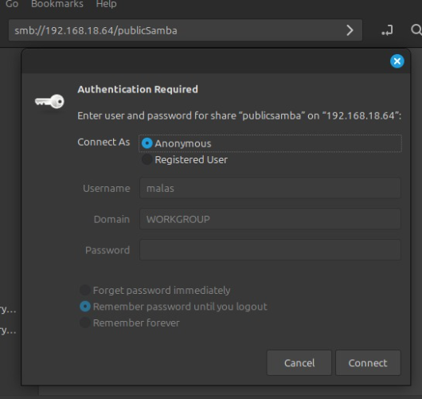

  Untuk membuka folder publicSamba di file explorer linux, tekan “CTRL + L” lalu ketik “smb://[IP-Server]/publicSamba” setelah itu akan ada Authentication Required. Untuk public shared folder bisa langsung saja connect sebagai Anonymous.

  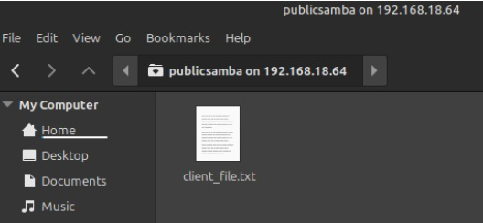

  Tampilan ketika berhasil mengakses folder publicSamba.

- Akses folder melalui windows client

  

  Untuk membuka folder publicSamba di windows, tekan “Windows + R” lalu ketik “\\[IP-Server]\publicSamba”.

  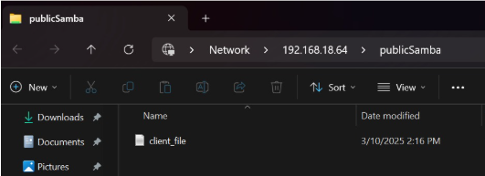

  Setelah itu akan langsung berhasil mengakses folder publicSamba tanpa harus melakukan authentication.

### 2. Membuat limited shared folder

Tentukan pengguna/grup yang bisa mengakses limited shared folder. Misalnya, buat grup limited-samba-user dan menambahkan user samba1 dan samba2:

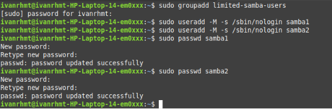

Tambahkan pengguna ke grup:

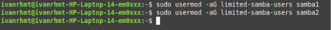

Tambahkan pengguna ke samba:

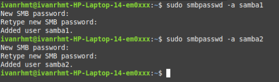

Atur hak akses folder limitedSamba:

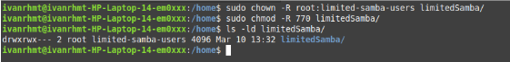

Perintah di atas bertujuan agar hanya grup limited-samba-users yang memiliki akses dan hanya owner dan grup yang bisa baca/tulis, user lain ditolak.

Setelah itu, edit file konfigurasi samba menggunakan perintah:

```bash
sudo nano /etc/samba/smb.conf
```

Tambahkan konfigurasi berikut:

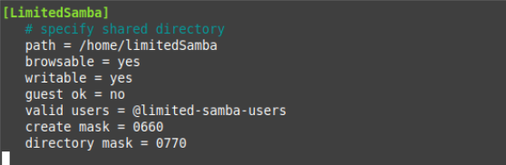

Agar perubahan konfigurasi diterapkan, restart layanan samba dan pastikan samba berjalan dengan baik.


- Akses folder melalui CLI client

  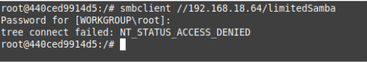

  Ini menunjukkan bahwa tidak semua user dalam koneksi yang sama bisa mengakses folder limitedSamba. Hanya user-user yang termasuk dalam grup limited-samba-users yang bisa mengakses file tersebut.

  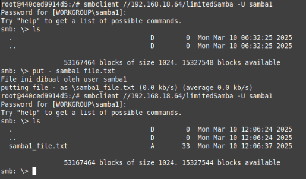

  User samba1 bisa mengakses folder limitedSamba karena samba1 termasuk ke dalam grup limited-samba-users. User tersebut juga memiliki hak akses penuh terhadap folder tersebut.

  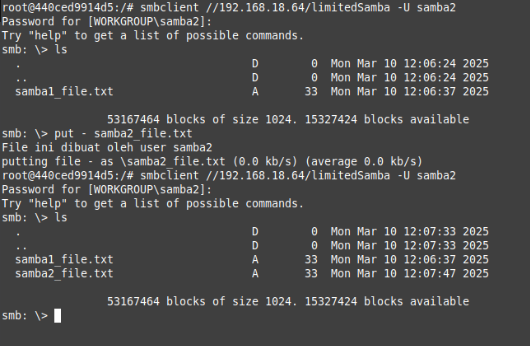

  Sama halnya dengan user samba1, user samba2 juga bisa mengakses folder limitedSamba karena samba2 juga termasuk ke dalam grup limited-samba-users. User tersebut juga memiliki hak akses penuh terhadap folder tersebut.

  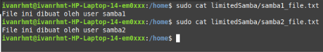

  Server dapat melihat file yang telah dibuat oleh client.

- Akses folder melalui linux client via file manager

  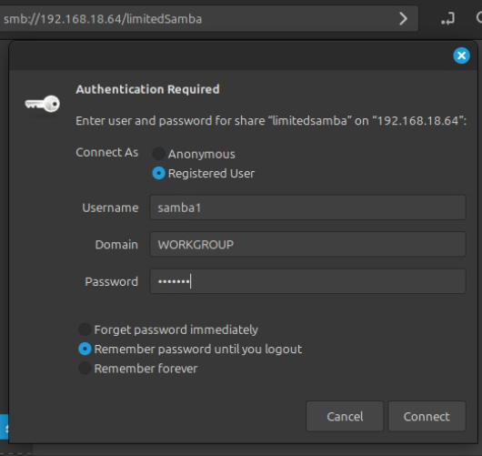

  Untuk membuka folder limitedSamba di file explorer linux, tekan “CTRL + L” lalu ketik “smb://[IP-Server]/limitedSamba” setelah itu akan ada Authentication Required. Untuk limited shared folder tidak bisa langsung saja connect sebagai Anonymous. Harus connect sebagai user yang termasuk ke dalam grup limited-samba-users yaitu samba1 atau samba2.

  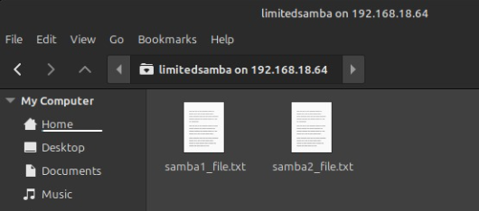

  Tampilan ketika berhasil mengakses folder limitedSamba.

- Akses folder melalui windows client

  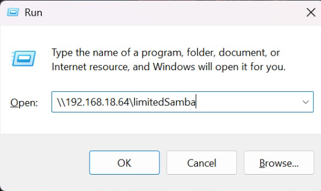

  Untuk membuka folder limitedSamba di windows, tekan “Windows + R” lalu ketik “\\[IP-Server]\limitedSamba”.

  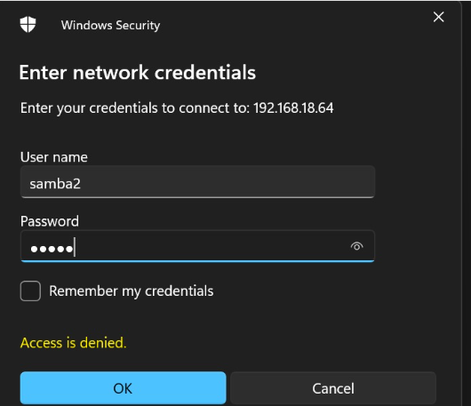

  Setelah itu akan ada authentication. Masuk sebagai user samba1 atau samba2.

  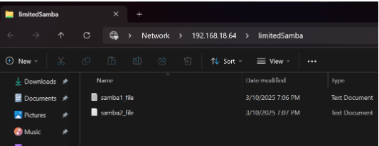

  Tampilan ketika berhasil mengakses folder limitedSamba di windows.
