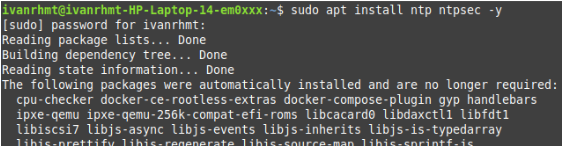
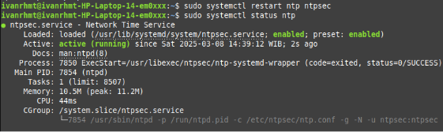
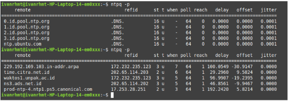

<h1 align="center">
  Instalasi NTP Client
</h1>

 

1. Buka terminal lalu install paket NTP yang dibutuhkan dengan “apt install ntp ntpsec”.
   

2. Setelah instalasi selesai, edit file konfigurasi NTP di “/etc/ntpsec/ntp.conf”. Cari bagian yang berisi daftar server NTP default.
   

   Lalu ubah server NTP default menjadi server NTP Indonesia.

   

   Simpan perubahan dengan CTRL + X, lalu tekan Y dan Enter.

3. Restart layanan NTP dengan perintah “sudo systemctl restart ntp ntpsec” agar perubahan diterapkan. Pastikan layanan berjalan dengan baik menggunakan perintah “sudo systemctl status ntp”.
   

4. Gunakan perintah “ntpq -p” untuk memeriksa apakah waktu sudah sinkron dengan server NTP.
   
   Output di atas menunjukkan status sinkronisasi waktu antara sistem lokal dan server NTP yang dikonfigurasi. Pada bagian pertama, terlihat bahwa server NTP seperti “1.id.pool.ntp.org”, “2.id.pool.ntp.org”, dan “ntp.ubuntu.com” belum dapat dihubungi (reach 0), yang berarti sistem belum berhasil melakukan sinkronisasi dengan server-server tersebut. Namun, pada bagian kedua, terlihat bahwa beberapa server seperti “time.citra.net.id”, “waktos1.unpak.ac.id”, dan “prod-ntp-4.ntp1.ps5.canonical.com” telah berhasil dihubungi (reach 1) dan menunjukkan nilai delay, offset, dan jitter yang bervariasi.
