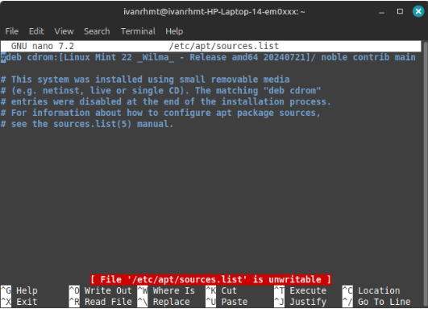
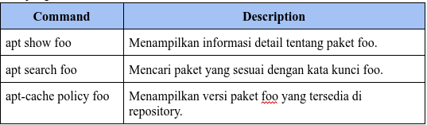
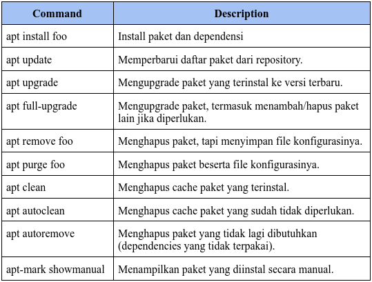

<h1 align="center">
  Instalasi dan Konfigurasi Samba
</h1>

<br>

## 1. The software sources

Debian GNU/Linux menggunakan metodologi repository untuk mendistribusikan aplikasi. Metodologi ini memungkinkan sentralisasi perangkat lunak dan penggunaan antarmuka yang sederhana untuk mengelola dan memperbarui sistem. Dengan cara ini, pengguna tidak perlu mengunjungi situs-situs perangkat lunak secara langsung untuk mengunduh atau memperbarui aplikasi. Repository menyediakan cara yang terorganisir dan efisien untuk mengakses dan mengelola paket-paket perangkat lunak.

### 1.1 The sources.list file

File sources.list pada Debian GNU/Linux berisi alamat Internet dari repository yang digunakan untuk mengelola dan memperbarui sistem. File ini dapat ditemukan di /etc/apt/sources.list atau file dengan format /etc/apt/sources.list.d/xxx.list. Untuk mengedit file ini, pengguna dapat menggunakan perintah seperti di bawah ini.

```bash
apt edit-sources
nano /etc/apt/sources.list
```



Dalam file sources.list, terdapat beberapa komponen penting:

- “deb”: Menunjukkan repository biner (berisi software yang sudah dikompilasi).
- “deb-src”: Menunjukkan repository sumber (berisi kode program yang digunakan untuk mengkompilasi software).
- “http:...” atau “https:...”: Alamat Internet dari server repository.
- “bookworm” atau “bookworm-security”: Cabang (branch) dalam repository.
- “main” atau “non-free-firmware”: Bagian (section) dari repository.

Pertanyaan umum adalah mengapa menggunakan "bookworm" dan bukan "stable". bookworm adalah nama spesifik dari versi sistem yang terinstal, yang menentukan versi tertentu dari setiap paket dalam repository. Sementara itu, stable adalah nama generik untuk versi stabil saat ini. Saat ini, Debian 12 "bookworm" adalah versi stable, tetapi ketika Debian 13 "Trixie" dirilis, "bookworm" akan berubah status menjadi oldstable. Dengan menggunakan nama spesifik versi seperti "bookworm", pengguna dapat mengontrol kapan ingin melakukan pembaruan ke versi berikutnya, berbeda dengan sistem yang memaksakan pembaruan otomatis.

### 1.2 About repositories, branches and sections/components

Debian mengorganisir paket-paket software di dalam repository. Repository ini dibagi menjadi beberapa branch (cabang) dan section/component (bagian/komponen). Berikut penjelasannya:

Branch:

- **Stable**: Versi resmi Debian yang stabil dan direkomendasikan untuk penggunaan sehari-hari.
- **Testing**: Versi yang sedang dipersiapkan untuk menjadi versi stabil berikutnya.
- **Unstable (Sid)**: Versi yang selalu mendapatkan pembaruan terbaru, tetapi kurang stabil.
- **Experimental**: Repository untuk menguji versi alpha atau beta dari software.

Section/Component:

- **Main**: Berisi software yang sepenuhnya mematuhi DFSG (Debian Free Software Guidelines) dan tidak memiliki dependensi "non-free".
- **Non-free-firmware**: Berisi firmware yang bersifat "non-free" dan sudah termasuk secara default sejak Debian 12.
- **Contrib**: Berisi software yang mematuhi DFSG tetapi memiliki dependensi "non-free".
- **Non-free**: Berisi software yang tidak mematuhi DFSG.

DFSG (Debian Free Software Guidelines) adalah prinsip filosofis Debian tentang software bebas (libre software). Hanya paket-paket dalam bagian main yang sepenuhnya didukung oleh proyek Debian dan merupakan software bebas 100%. Sementara itu, paket-paket di contrib, non-free, dan non-free-firmware bersifat sebagian atau sepenuhnya tidak bebas.

### 1.3 Backport packages

Debian menyediakan repository khusus yang disebut backports. Repository ini berisi versi yang lebih baru dari beberapa aplikasi. Repository backports tidak diaktifkan secara default, tetapi tidak menimbulkan risiko khusus untuk sistem Anda karena repository reguler memiliki prioritas tertinggi selama proses pembaruan. Hanya aplikasi yang diinstal dari backports yang akan menggunakan repository ini.

Backports tidak ada kaitannya dengan "backdoor" yang dipakai untuk memata-matai sistem proprietary. Backport adalah mekanisme yang memungkinkan aplikasi dari repository pengembangan Debian untuk dibawa kembali ke versi "stable". Misalnya, pengembang Debian mengambil versi terbaru LibreOffice dari repository pengembangan, lalu mengkompilasi ulang paketnya dengan menyesuaikan dependensi yang ada di versi "stable".

Kalau mencari aplikasi tertentu, ada dua cara:

- Pakai alat pencarian paket.
- Cari berdasarkan kategori.

### 1.4 Modifying the Repositories

Sebelum memodifikasi sumber software di sistem, perlu disadari risiko yang mungkin terjadi saat menggunakan komponen "contrib" atau "non-free" dari repository:

- Paket non-free kurang bebas.
- Tidak didukung resmi oleh Debian karena kode sumbernya tidak tersedia.
- Bisa "mengotori" sistem Debian yang sepenuhnya bebas.

Untuk modifikasi repository, edit file "sources.list" dengan perintah:

```bash
apt edit-sources
```

File akan terbuka di editor teks default (seperti nano atau vim). Setelah edit, simpan perubahan.

Contoh baris repository:

- Hanya paket bebas
  ```bash
  deb http://deb.debian.org/debian/ bookworm main
  ```
- Paket bebas + proprietary
  ```bash
  deb http://deb.debian.org/debian/ bookworm main contrib non-free non-free-firmware
  ```

Dengan ini, bisa instal codec atau driver proprietary. Modifikasi juga bisa dilakukan lewat Synaptic Package Manager secara grafis.

## 2. APT in a terminal

APT (Advanced Package Tool) adalah alat utama untuk mengelola paket di Debian. Berikut beberapa perintah penting.

### 2.1 ‘User’ command to search and display information

perintah ini dapat dijalankan sebagai pengguna sederhana, karena tidak mempengaruhi sistem.



### 2.2 ‘Administrator’ mode commands for system maintenance

Perintah-perintah ini harus dijalankan dengan hak administrator "root" karena perintah-perintah ini berdampak pada sistem.



Contoh perintah All-in-One:

```bash
apt update && apt full-upgrade && apt autoclean
```

Perintah ini akan melakukan update daftar paket, upgrade sistem, dan bersihkan paket yang tidak diperlukan.

## 3. Software: the simplified package manager

Software adalah aplikasi berbasis GUI yang memudahkan pengguna Debian untuk mengelola paket aplikasi.

### 3.1 Searching an application

Software bisa mencari aplikasi dengan mengetik nama atau menjelajahi kategori seperti Explore, Installed, dan Updates.

### 3.2 Installing an application

Klik aplikasi yang diinginkan, lalu pilih Install. Sistem akan meminta password administrator untuk konfirmasi.

### 3.3 Removing an application

Buka kategori Installed, pilih aplikasi, lalu klik Remove.

### 3.4 Upgrading your applications

Jika ada pembaruan, aplikasi akan muncul di kategori Updates. Klik Install Updates untuk memulai proses pembaruan.

### 3.5 Modify packages repositories

Bisa menambahkan atau mengubah repository melalui menu Repositories, termasuk menambahkan sumber non-free jika diperlukan.

### 3.6 Kelebihan Software

- Mudah Digunakan: Cocok untuk pengguna yang tidak terbiasa dengan terminal.
- Grafis: Antarmuka yang intuitif dan ramah pengguna.
- Lengkap: Bisa mencari, instal, hapus, dan update aplikasi dalam satu tempat.

## 4. Discover: the KDE package manager

### 4.1

### 4.2

### 4.3

### 4.4

### 4.5

## 5. Synaptic: the comprehensive package manager

### 5.1

### 5.2

### 5.3

### 5.4

### 5.5

### 5.6

### 5.7

### 5.8

## 6. Cleaning the system

### 6.1

### 6.2

### 6.3

### 6.4

### 6.5

## 7. Installing external “.deb” packages

### 7.1

### 7.2

## 8. Installing Flatpak applications

### 8.1

### 8.2

### 8.3

### 8.4

### 8.5

### 8.6

## 9. Who is this Sid guy?

Debian memiliki beberapa cabang distribusi yang berjalan secara paralel, masing-masing dengan tujuan dan tingkat stabilitas yang berbeda. Stable distribution adalah versi resmi Debian yang saat ini dirilis. Versi ini hanya menerima pembaruan keamanan dan perbaikan bug, sehingga sangat direkomendasikan untuk penggunaan umum.

Oldstable distribution adalah versi stabil sebelumnya. Biasanya, versi ini didukung selama satu tahun setelah rilis versi baru. Namun, jika ada dukungan dari komunitas atau perusahaan, masa dukungan dapat diperpanjang menjadi LTS (Long Term Support).

Testing distribution adalah versi yang dipersiapkan untuk menjadi stabil di masa depan. Di versi ini, semua fitur dan perbaikan bug diselesaikan sebelum diresmikan sebagai versi stabil baru. Setelah melalui proses pembekuan perangkat lunak dan perburuan bug, versi pengujian ini akan menjadi versi stabil berikutnya.

Unstable distribution, yang dijuluki Sid, adalah versi yang selalu mendapatkan pembaruan paket terbaru dan berada di garis depan inovasi. Meskipun kurang stabil, beberapa pengguna berani menggunakannya sehari-hari untuk mencoba fitur-fitur terbaru.

Experimental distribution bukanlah distribusi resmi Debian, melainkan repositori tempat versi alpha atau beta perangkat lunak diuji. Ini adalah tempat untuk menguji perangkat lunak yang masih dalam tahap pengembangan awal.

Setiap distribusi ini memiliki nama panggilan berdasarkan karakter film Toy Story. Saat ini, versi stabil disebut Bookworm, versi pengujian disebut Trixie, dan versi stabil lama disebut Bullseye. Distribusi eksperimental tidak memiliki nama panggilan khusus.
