<h1 align="center">
  Instalasi dan Konfigurasi Samba
</h1>

<br>

## 1. The software sources

Debian GNU/Linux menggunakan metodologi repository untuk mendistribusikan aplikasi. Metodologi ini memungkinkan sentralisasi perangkat lunak dan penggunaan antarmuka yang sederhana untuk mengelola dan memperbarui sistem. Dengan cara ini, pengguna tidak perlu mengunjungi situs-situs perangkat lunak secara langsung untuk mengunduh atau memperbarui aplikasi. Repository menyediakan cara yang terorganisir dan efisien untuk mengakses dan mengelola paket-paket perangkat lunak.

### 1.1 The sources.list file

File sources.list pada Debian GNU/Linux berisi alamat Internet dari repository yang digunakan untuk mengelola dan memperbarui sistem. File ini dapat ditemukan di /etc/apt/sources.list atau file dengan format /etc/apt/sources.list.d/xxx.list. Untuk mengedit file ini, pengguna dapat menggunakan perintah seperti di bawah ini.

```bash
apt edit-sources
nano /etc/apt/sources.list
```

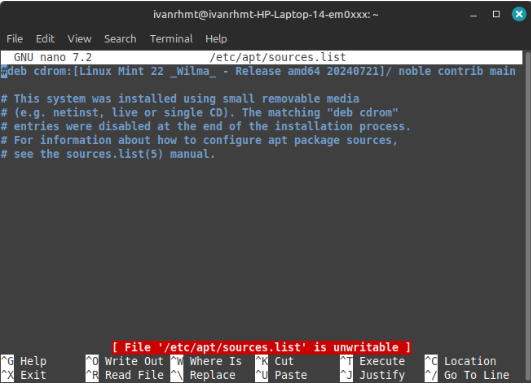

Dalam file sources.list, terdapat beberapa komponen penting:

- “deb”: Menunjukkan repository biner (berisi software yang sudah dikompilasi).
- “deb-src”: Menunjukkan repository sumber (berisi kode program yang digunakan untuk mengkompilasi software).
- “http:...” atau “https:...”: Alamat Internet dari server repository.
- “bookworm” atau “bookworm-security”: Cabang (branch) dalam repository.
- “main” atau “non-free-firmware”: Bagian (section) dari repository.

Pertanyaan umum adalah mengapa menggunakan "bookworm" dan bukan "stable". bookworm adalah nama spesifik dari versi sistem yang terinstal, yang menentukan versi tertentu dari setiap paket dalam repository. Sementara itu, stable adalah nama generik untuk versi stabil saat ini. Saat ini, Debian 12 "bookworm" adalah versi stable, tetapi ketika Debian 13 "Trixie" dirilis, "bookworm" akan berubah status menjadi oldstable. Dengan menggunakan nama spesifik versi seperti "bookworm", pengguna dapat mengontrol kapan ingin melakukan pembaruan ke versi berikutnya, berbeda dengan sistem yang memaksakan pembaruan otomatis.

### 1.2 About repositories, branches and sections/components

Debian mengorganisir paket-paket software di dalam repository. Repository ini dibagi menjadi beberapa branch (cabang) dan section/component (bagian/komponen). Berikut penjelasannya:

Branch:

- **Stable**: Versi resmi Debian yang stabil dan direkomendasikan untuk penggunaan sehari-hari.
- **Testing**: Versi yang sedang dipersiapkan untuk menjadi versi stabil berikutnya.
- **Unstable (Sid)**: Versi yang selalu mendapatkan pembaruan terbaru, tetapi kurang stabil.
- **Experimental**: Repository untuk menguji versi alpha atau beta dari software.

Section/Component:

- **Main**: Berisi software yang sepenuhnya mematuhi DFSG (Debian Free Software Guidelines) dan tidak memiliki dependensi "non-free".
- **Non-free-firmware**: Berisi firmware yang bersifat "non-free" dan sudah termasuk secara default sejak Debian 12.
- **Contrib**: Berisi software yang mematuhi DFSG tetapi memiliki dependensi "non-free".
- **Non-free**: Berisi software yang tidak mematuhi DFSG.

DFSG (Debian Free Software Guidelines) adalah prinsip filosofis Debian tentang software bebas (libre software). Hanya paket-paket dalam bagian main yang sepenuhnya didukung oleh proyek Debian dan merupakan software bebas 100%. Sementara itu, paket-paket di contrib, non-free, dan non-free-firmware bersifat sebagian atau sepenuhnya tidak bebas.

### 1.3 Backport packages

Debian menyediakan repository khusus yang disebut backports. Repository ini berisi versi yang lebih baru dari beberapa aplikasi. Repository backports tidak diaktifkan secara default, tetapi tidak menimbulkan risiko khusus untuk sistem Anda karena repository reguler memiliki prioritas tertinggi selama proses pembaruan. Hanya aplikasi yang diinstal dari backports yang akan menggunakan repository ini.

Backports tidak ada kaitannya dengan "backdoor" yang dipakai untuk memata-matai sistem proprietary. Backport adalah mekanisme yang memungkinkan aplikasi dari repository pengembangan Debian untuk dibawa kembali ke versi "stable". Misalnya, pengembang Debian mengambil versi terbaru LibreOffice dari repository pengembangan, lalu mengkompilasi ulang paketnya dengan menyesuaikan dependensi yang ada di versi "stable".

Kalau mencari aplikasi tertentu, ada dua cara:

- Pakai alat pencarian paket.
- Cari berdasarkan kategori.

### 1.4 Modifying the Repositories

Sebelum memodifikasi sumber software di sistem, perlu disadari risiko yang mungkin terjadi saat menggunakan komponen "contrib" atau "non-free" dari repository:

- Paket non-free kurang bebas.
- Tidak didukung resmi oleh Debian karena kode sumbernya tidak tersedia.
- Bisa "mengotori" sistem Debian yang sepenuhnya bebas.

Untuk modifikasi repository, edit file "sources.list" dengan perintah:

```bash
apt edit-sources
```

File akan terbuka di editor teks default (seperti nano atau vim). Setelah edit, simpan perubahan.

Contoh baris repository:

- Hanya paket bebas
  ```bash
  deb http://deb.debian.org/debian/ bookworm main
  ```
- Paket bebas + proprietary
  ```bash
  deb http://deb.debian.org/debian/ bookworm main contrib non-free non-free-firmware
  ```

Dengan ini, bisa instal codec atau driver proprietary. Modifikasi juga bisa dilakukan lewat Synaptic Package Manager secara grafis.

## 2. APT in a terminal

APT (Advanced Package Tool) adalah alat utama untuk mengelola paket di Debian. Berikut beberapa perintah penting.

### 2.1 ‘User’ command to search and display information

perintah ini dapat dijalankan sebagai pengguna sederhana, karena tidak mempengaruhi sistem.

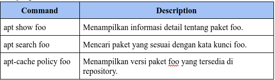

### 2.2 ‘Administrator’ mode commands for system maintenance

Perintah-perintah ini harus dijalankan dengan hak administrator "root" karena perintah-perintah ini berdampak pada sistem.

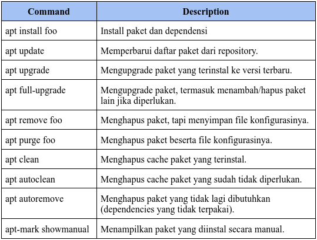

Contoh perintah All-in-One:

```bash
apt update && apt full-upgrade && apt autoclean
```

Perintah ini akan melakukan update daftar paket, upgrade sistem, dan bersihkan paket yang tidak diperlukan.

## 3. Software: the simplified package manager

Software adalah aplikasi berbasis GUI yang memudahkan pengguna Debian untuk mengelola paket aplikasi.

### 3.1 Searching an application

Software bisa mencari aplikasi dengan mengetik nama atau menjelajahi kategori seperti Explore, Installed, dan Updates.

### 3.2 Installing an application

Klik aplikasi yang diinginkan, lalu pilih Install. Sistem akan meminta password administrator untuk konfirmasi.

### 3.3 Removing an application

Buka kategori Installed, pilih aplikasi, lalu klik Remove.

### 3.4 Upgrading your applications

Jika ada pembaruan, aplikasi akan muncul di kategori Updates. Klik Install Updates untuk memulai proses pembaruan.

### 3.5 Modify packages repositories

Bisa menambahkan atau mengubah repository melalui menu Repositories, termasuk menambahkan sumber non-free jika diperlukan.

### 3.6 Kelebihan Software

- Mudah Digunakan: Cocok untuk pengguna yang tidak terbiasa dengan terminal.
- Grafis: Antarmuka yang intuitif dan ramah pengguna.
- Lengkap: Bisa mencari, instal, hapus, dan update aplikasi dalam satu tempat.

## 4. Discover: the KDE package manager

Discover adalah manajer paket berbasis GUI yang dirancang untuk lingkungan desktop KDE Plasma. Ini memungkinkan pengguna untuk mencari, menginstal, menghapus, dan memperbarui aplikasi dengan mudah. Discover memiliki antarmuka yang bersih dan mudah dinavigasi, dengan kategori seperti Games, Graphics, Internet, dan lainnya.

### 4.1 Search and install with Discover

Pengguna bisa mencari aplikasi dengan mengetik nama di kolom pencarian atau menjelajahi kategori yang tersedia.

Setelah menemukan aplikasi, klik Install untuk mengunduh dan menginstalnya. Sistem akan meminta konfirmasi administrator.

Discover juga mendukung instalasi add-ons dan Plasma widgets untuk memperkaya fungsionalitas desktop KDE.

### 4.2 Uninstalling an application with Discover

Discover memungkinkan penghapusan aplikasi yang sudah terinstal dengan mudah melalui antarmuka grafis. Pengguna bisa menghapus aplikasi beserta dependensi yang tidak terpakai.

### 4.3 Updating your applications

Discover menampilkan pembaruan yang tersedia untuk sistem dan aplikasi. Pengguna bisa mengklik Update untuk memulai proses pembaruan.

### 4.4 Managing repositories

Discover memungkinkan pengguna untuk menambahkan atau mengubah sumber repository melalui menu Settings. Ini termasuk menambahkan repository non-free jika diperlukan.

### 4.5 Kelebihan Discover

- Ramah Pengguna: Antarmuka yang sederhana dan mudah digunakan.
- Lengkap: Mendukung instalasi, pembaruan, dan penghapusan aplikasi.
- Integrasi KDE: Dirancang khusus untuk lingkungan desktop KDE, sehingga terintegrasi dengan baik.

## 5. Synaptic: the comprehensive package manager

Synaptic adalah manajer paket berbasis GUI yang lebih detail dan komprehensif dibandingkan dengan Software atau Discover. Ini cocok untuk pengguna yang ingin kontrol penuh atas paket di sistem mereka.

### 5.1 Main interface

Antarmuka Synaptic terbagi menjadi empat area utama: toolbar di bagian atas yang berisi tombol-tombol fungsi, panel kiri untuk menyortir dan memilih paket, panel tengah yang menampilkan daftar paket, dan panel bawah yang menampilkan deskripsi paket yang dipilih. Setiap paket memiliki kotak kecil di depannya yang menunjukkan status: putih untuk paket belum terinstal, hijau untuk paket terinstal, dan merah untuk paket bermasalah. Logo Debian menandakan paket tersebut adalah "free software". Pengguna disarankan menjelajahi berbagai menu Synaptic untuk memahami fungsionalitasnya tanpa takut merusak sistem, karena tidak ada perubahan yang terjadi sampai tombol Apply diklik dan selalu ada konfirmasi sebelum perubahan diterapkan. Langkah pertama saat membuka Synaptic adalah klik tombol "Reload" untuk memperbarui informasi repository, paket, dan aplikasi yang tersedia.

### 5.2 Managing the repositories with Synaptic

Synaptic memungkinkan pengguna untuk mengelola repository secara grafis melalui antarmuka yang mudah digunakan. Untuk mengaksesnya, buka Synaptic dan pilih Settings > Repositories. Di sini, pengguna dapat melihat daftar repository yang aktif, yang sesuai dengan isi file /etc/apt/sources.list. Repository yang ada bisa diedit dengan mengkliknya, atau pengguna dapat menambahkan repository baru dengan mengklik tombol New. Setelah menambahkan atau mengubah repository, Synaptic akan meminta untuk memuat ulang daftar paket agar perubahan dapat diterapkan. Fitur ini memudahkan pengguna dalam menyesuaikan sumber paket sesuai kebutuhan, termasuk menambahkan repository non-free atau contrib jika diperlukan.

### 5.3 Updating the system with Synaptic

Sebelum memperbarui sistem, langkah pertama adalah memuat ulang daftar paket dengan mengklik tombol Reload atau melalui menu Edit > Reload Packages Information. Ini memastikan informasi paket terbaru dari repository sudah diperbarui. Setelah itu, pengguna bisa menandai semua paket yang dapat di-upgrade dengan mengklik Mark All Upgrades atau melalui menu Edit > Mark All Upgrades. Jika tidak ada paket yang perlu di-upgrade, artinya sistem sudah mutakhir. Namun, jika ada paket yang bisa di-upgrade, Synaptic akan menampilkannya di bagian Status > Installed (upgradable). Pengguna juga bisa melihat dependensi tambahan yang diperlukan sebelum mengkonfirmasi pembaruan. Setelah memeriksa daftar paket yang akan di-upgrade, klik Apply untuk memulai proses pembaruan. Synaptic akan mengunduh dan menginstal paket-paket tersebut, dan pengguna akan mendapat notifikasi setelah proses selesai. Dengan Synaptic, memperbarui sistem menjadi lebih terkontrol dan terstruktur.

### 5.4 Searching for a software

Synaptic menyediakan fitur pencarian yang powerful untuk menemukan paket yang dibutuhkan. Pengguna bisa mencari paket dengan mengetik nama atau kata kunci di kolom pencarian, lalu memilih opsi pencarian berdasarkan nama atau deskripsi. Jika nama paket tidak diketahui, pengguna bisa menjelajahi paket berdasarkan kategori di panel kiri, seperti Games, Multimedia, atau Development. Misalnya, untuk mencari paket game, pengguna bisa memilih kategori Games and Amusement di bagian Sections. Synaptic akan menampilkan daftar paket yang sesuai dengan kategori tersebut di panel tengah. Fitur pencarian ini memudahkan pengguna untuk menemukan paket yang dibutuhkan, baik untuk instalasi, pembaruan, atau sekadar melihat informasi detail tentang paket tersebut. Dengan antarmuka yang terorganisir, Synaptic membuat pencarian paket menjadi lebih efisien dan terarah.

### 5.5 Installing a package with Synaptic

Untuk menginstal paket di Synaptic, pengguna cukup mencari paket yang diinginkan melalui fitur pencarian atau menjelajahi kategori yang tersedia. Setelah menemukan paket, klik kanan pada paket tersebut dan pilih Mark for Installation. Jika paket memerlukan dependensi tambahan, Synaptic akan otomatis menambahkannya ke daftar instalasi. Setelah semua paket yang ingin diinstal ditandai, klik Apply untuk memulai proses instalasi. Synaptic akan mengunduh dan menginstal paket beserta dependensinya, dan pengguna akan mendapat notifikasi setelah proses selesai. Fitur ini memudahkan pengguna untuk menginstal paket dengan aman dan terstruktur, termasuk memastikan semua dependensi terpenuhi.

### 5.6 Uninstall a package with Synaptic

Untuk menghapus paket di Synaptic, pengguna bisa mencari paket yang ingin dihapus melalui fitur pencarian atau menjelajahi kategori Installed. Setelah menemukan paket, klik kanan dan pilih Mark for Removal untuk menghapus paket namun menyimpan file konfigurasinya, atau Mark for Complete Removal untuk menghapus paket beserta file konfigurasinya (setara dengan perintah purge di terminal). Setelah paket ditandai untuk dihapus, klik Apply untuk memulai proses penghapusan. Synaptic juga menyediakan fitur untuk membersihkan paket tidak terpakai (dependencies yang sudah tidak diperlukan) melalui kategori Installed (auto removable). Dengan Synaptic, menghapus paket menjadi lebih terkontrol dan aman, termasuk memastikan tidak ada sisa file yang tidak diperlukan.

### 5.7 Look at detailed information on a package

Synaptic menyediakan fitur untuk melihat informasi detail tentang paket yang dipilih. Pengguna bisa mengklik paket yang diinginkan, dan deskripsi singkat akan muncul di panel bawah. Untuk informasi lebih lengkap, klik kanan pada paket dan pilih Properties. Di sini, pengguna bisa melihat berbagai detail seperti dependensi, file yang diinstal, ukuran paket, dan versi. Fitur ini sangat berguna untuk memahami struktur paket, memeriksa dependensi, atau sekadar melihat informasi teknis sebelum menginstal atau menghapus paket. Dengan informasi yang lengkap, pengguna bisa membuat keputusan yang lebih tepat dalam mengelola paket di sistem mereka.

### 5.8 Synaptic preferences

Preferences di Synaptic memungkinkan pengguna menyesuaikan pengaturan sesuai kebutuhan. Terdapat beberapa tab:

- General: Mengatur konfirmasi sebelum perubahan diterapkan.
- Columns and Fonts: Menyesuaikan tampilan kolom dan font di antarmuka.
- Colors: Mengatur warna berdasarkan status paket.
- Files: Mengelola cache paket, seperti menghapus file setelah instalasi.
- Network: Mengatur koneksi internet untuk mengunduh paket.
- Distribution: Mengontrol perilaku pembaruan paket.

## 6. Cleaning the system

Debian menyediakan beberapa cara untuk membersihkan sistem dan mengosongkan ruang disk. Berikut beberapa langkah yang bisa dilakukan.

### 6.1 Disk space information

Untuk membersihkan sistem, langkah pertama adalah memeriksa penggunaan ruang disk. Berikut beberapa cara memeriksa penggunaan ruang disk menggunakan terminal untuk membersihkan sistem:

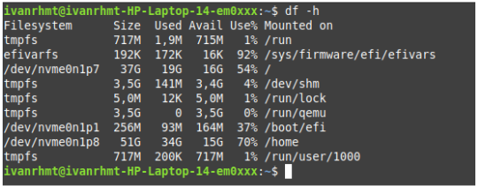

“df -h”: Menampilkan penggunaan ruang disk untuk setiap partisi atau mount point.

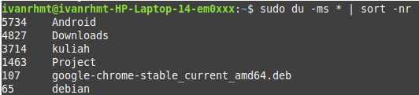

“du -ms \* | sort -nr”: Menampilkan direktori dan ukurannya, diurutkan dari yang terbesar.

“ncdu”: Alat analisis ruang disk berbasis terminal yang interaktif. Bisa diinstal dengan perintah:

```bash
apt update && apt install ncdu
```

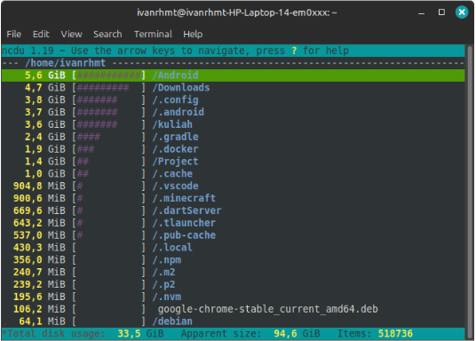

“Baobab”: Alat analisis ruang disk berbasis grafis. Bisa diinstal dengan perintah:

```bash
apt update && apt install baobab
```

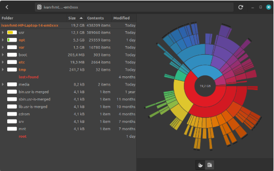

### 6.2 Cleaning the package

Debian menyimpan cache paket di /var/cache/apt/archives/ untuk memungkinkan instalasi ulang tanpa koneksi internet. Namun, cache ini bisa memakan ruang disk yang cukup besar. Berikut beberapa cara untuk membersihkan paket yang tidak diperlukan:

- Membersihkan cache paket
  “apt clean”: Menghapus semua cache paket yang sudah terinstal. “apt autoclean”: Menghapus cache paket yang sudah tidak diperlukan (obsolete).

  ```bash
  sudo apt clean
  sudo apt autoclean
  ```

  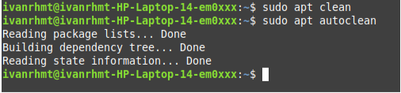

- Menghapus paket tidak terpakai
  Paket yang tidak terpakai (dependencies yang sudah tidak diperlukan) bisa dihapus dengan perintah “apt autoremove --purge”. Perintah ini juga akan menghapus file konfigurasi yang terkait.

  ```bash
  sudo apt autoremove --purge
  ```

  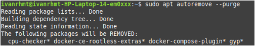

- Menghapus paket obsolete
  Paket obsolete adalah paket yang sudah tidak tersedia di repository. Untuk menemukannya, gunakan perintah “apt list '?obsolete'”, lalu hapus dengan “apt remove '?obsolete'”.

  ```bash
  sudo apt list '?obsolete'
  sudo apt remove '?obsolete'
  ```

  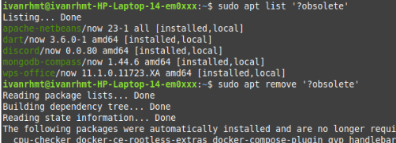

- Membersihkan file konfigurasi yang tersisa
  Terkadang, file konfigurasi tetap tersisa meskipun paket sudah dihapus.  
  Untuk menemukannya, gunakan perintah berikut:

  ```bash
  dpkg --list | awk '/^rc/ {print $2}'
  sudo apt purge $(dpkg --list | awk '/^rc/ {print $2}')
  ```

  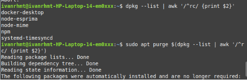

- Menghapus paket orphaned
  Paket orphaned adalah paket yang tidak memiliki dependensi. Untuk menemukannya, instal “deborphan”, lalu hapus paket yang tidak diperlukan.
  ```bash
  sudo apt install deborphan
  deborphan
  sudo apt autoremove --purge $(deborphan)
  ```
  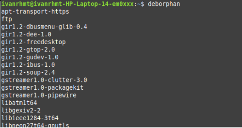

### 6.3 Emptying the trash bins

Debian memiliki beberapa tempat sampah (trash bins) yang perlu dibersihkan secara berkala untuk mengosongkan ruang disk. Berikut cara membersihkannya:

- Tempat Sampah Pengguna:
  Lokasi: “~/.local/share/Trash/”. Bisa dikosongkan melalui file manager sistem atau dengan perintah terminal:
  ```bash
  rm -rf ~/.local/share/Trash/\*
  ```
- Tempat Sampah Administrator:
  Lokasi: “/root/.local/share/Trash/”. Harus dikosongkan dengan hak akses administrator:

  ```bash
  sudo rm -rf /root/.local/share/Trash/\*
  ```

- Tempat Sampah Eksternal:
  Lokasi: Biasanya di “/media/your_id/your_disk/.Trash_1000/”. Dikosongkan dengan perintah:
  ```bash
  sudo rm -rf /root/.local/share/Trash/\*
  ```

### 6.4 Purging application caches

Beberapa aplikasi menyimpan data cache di folder ~/.cache/ untuk meningkatkan kinerja. Namun, cache ini bisa memakan ruang disk jika tidak dibersihkan secara berkala. Berikut cara membersihkannya:

- Membersihkan Cache Secara Manual:
  Hapus seluruh isi folder cache dengan perintah:

  ```bash
  rm -rf ~/.cache/\*
  ```

- Membersihkan Cache Aplikasi Tertentu:
  Beberapa aplikasi seperti Firefox memiliki opsi untuk membersihkan cache melalui menu pengaturan. Di Firefox, pengguna bisa mengatur agar cache dibersihkan secara otomatis setiap kali aplikasi ditutup.

- Cache di Folder “/tmp/”:
  Beberapa aplikasi menyimpan cache di folder “/tmp/”, yang akan otomatis dibersihkan saat sistem dimatikan atau di-reboot.

### 6.5 Purging the thumbnails

Thumbnail (gambar kecil) dibuat otomatis saat pengguna membuka folder yang berisi gambar atau video. Thumbnail ini disimpan di folder ~/.thumbnails/ untuk mempercepat tampilan di kemudian hari. Namun, thumbnail yang sudah tidak digunakan (karena file aslinya dihapus) bisa memakan ruang disk. Berikut cara membersihkannya:

```bash
rm -rf ~/.thumbnails/\*
```

## 7. Installing external “.deb” packages

Debian menggunakan sistem repository untuk mengelola paket, tetapi terkadang pengguna perlu menginstal paket eksternal dalam format .deb. Berikut cara menginstalnya:

### 7.1 Installation in graphic mode with GDebi

.deb adalah format paket yang digunakan oleh Debian untuk mendistribusikan software. Ini adalah file terkompresi yang berisi aplikasi beserta metadata dan dependensinya. GDebi adalah alat grafis untuk menginstal paket .deb sambil mengelola dependensi. Instal GDebi dengan perintah:

```bash
sudo apt install gdebi
```

Klik kanan file .deb, lalu pilih Open with GDebi untuk menginstalnya.

### 7.2 Installation in terminal mode with Dpkg

- Gunakan perintah dpkg untuk menginstal paket .deb:

  ```bash
  sudo dpkg -i nama_paket.deb
  ```

- Jika ada dependensi yang kurang, jalankan:
  ```bash
  sudo apt install -f
  ```

## 8. Installing Flatpak applications

### 8.1

### 8.2

### 8.3

### 8.4

### 8.5

### 8.6

## 9. Who is this Sid guy?

Debian memiliki beberapa cabang distribusi yang berjalan secara paralel, masing-masing dengan tujuan dan tingkat stabilitas yang berbeda. Stable distribution adalah versi resmi Debian yang saat ini dirilis. Versi ini hanya menerima pembaruan keamanan dan perbaikan bug, sehingga sangat direkomendasikan untuk penggunaan umum.

Oldstable distribution adalah versi stabil sebelumnya. Biasanya, versi ini didukung selama satu tahun setelah rilis versi baru. Namun, jika ada dukungan dari komunitas atau perusahaan, masa dukungan dapat diperpanjang menjadi LTS (Long Term Support).

Testing distribution adalah versi yang dipersiapkan untuk menjadi stabil di masa depan. Di versi ini, semua fitur dan perbaikan bug diselesaikan sebelum diresmikan sebagai versi stabil baru. Setelah melalui proses pembekuan perangkat lunak dan perburuan bug, versi pengujian ini akan menjadi versi stabil berikutnya.

Unstable distribution, yang dijuluki Sid, adalah versi yang selalu mendapatkan pembaruan paket terbaru dan berada di garis depan inovasi. Meskipun kurang stabil, beberapa pengguna berani menggunakannya sehari-hari untuk mencoba fitur-fitur terbaru.

Experimental distribution bukanlah distribusi resmi Debian, melainkan repositori tempat versi alpha atau beta perangkat lunak diuji. Ini adalah tempat untuk menguji perangkat lunak yang masih dalam tahap pengembangan awal.

Setiap distribusi ini memiliki nama panggilan berdasarkan karakter film Toy Story. Saat ini, versi stabil disebut Bookworm, versi pengujian disebut Trixie, dan versi stabil lama disebut Bullseye. Distribusi eksperimental tidak memiliki nama panggilan khusus.
