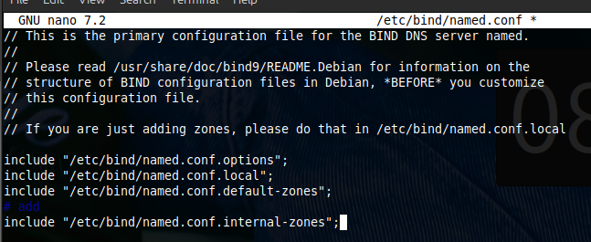
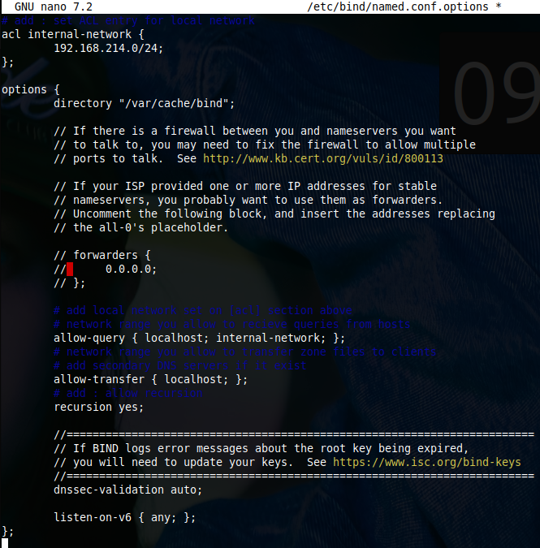
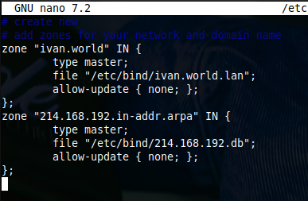
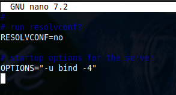
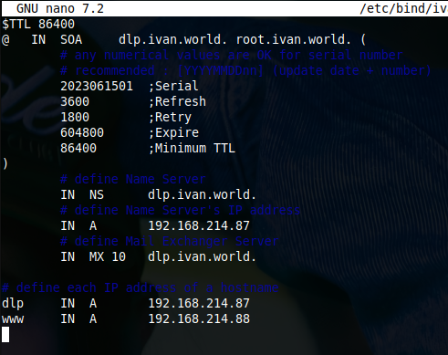
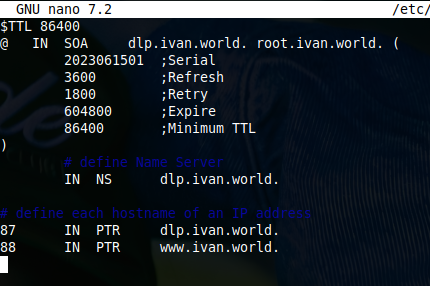
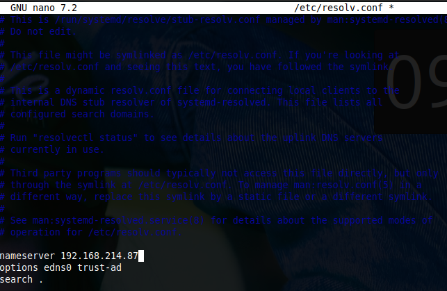
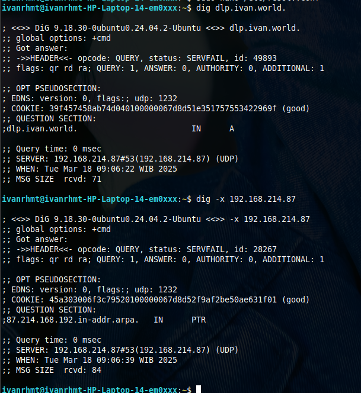

<h1 align="center">
  DNS Server
</h1>

<br>

## 1. Configure for Internal Network

Install BIND to Configure DNS (Domain Name System) Server to provide Name or Address Resolution service for Clients.

### [1] Install BIND

```bash
apt -y install bind9 bind9utils
```

### [2] Configure BIND for Internal Network.

Local network is [192.168.214.0/24], Domain name is [ivan.world].









### [3] Next, Configure Zone Files for each Zone set in [named.conf] above.

## 2. Configure Zone Files

### [1] Create zone files that servers resolve IP address from Domain name.



### [2] Create zone files that servers resolve Domain name from IP address.



### [3] Next, Start BIND and Verify Name or Address Resolution.

## 3. Verify Resolution

### [1] Restart BIND to apply changes.

```bash
systemctl restart named
```

### [2] Change DNS setting to refer to own DNS if need.



### [3] Verify Name and Address Resolution. If [ANSWER SECTION] is shown, that's OK.


