<h1 align="center">
  DNS and IP Forwarding
</h1>

<br/>

## Topology

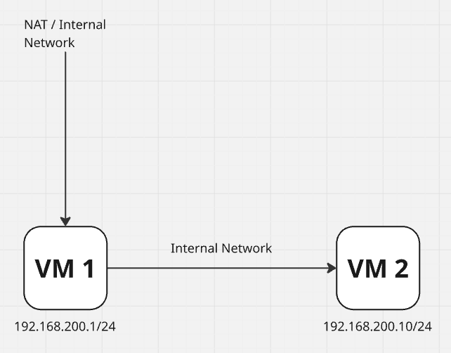

Pada topologi ini, VM1 berperan sebagai gateway yang menghubungkan VM2 ke internet dengan menggunakan IP forwarding. Selain itu, VM1 juga dikonfigurasi sebagai DNS server untuk domain `www.kelompok08.home`. Sementara itu, VM2 berfungsi sebagai klien jaringan yang menggunakan layanan dari VM1.

## Konfigurasi VM1

### [1] Konfigurasi network VM1 dengan 2 adapter

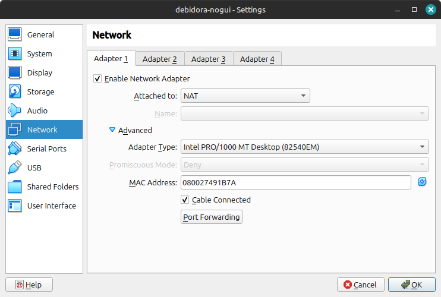

Adapter 1 menggunakan NAT agar VM1 bisa mengakses internet melalui IP host. Pada mode NAT ini, dilakukan port forwarding dengan pengaturan berikut:

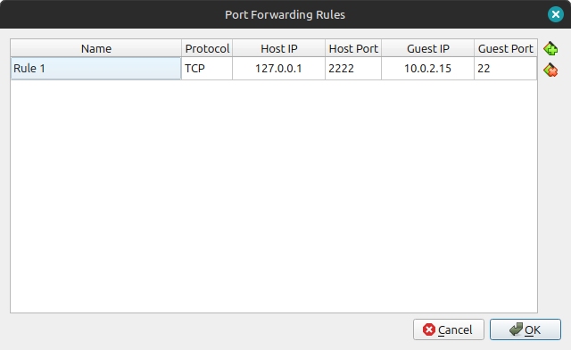

Pengaturan ini digunakan agar bisa mengakses VM1 via SSH dari host. Jadi, meskipun NAT menyembunyikan IP VM dari luar, tetap bisa mengakses terminal VM1 lewat port yang sudah diteruskan (port forwarding).

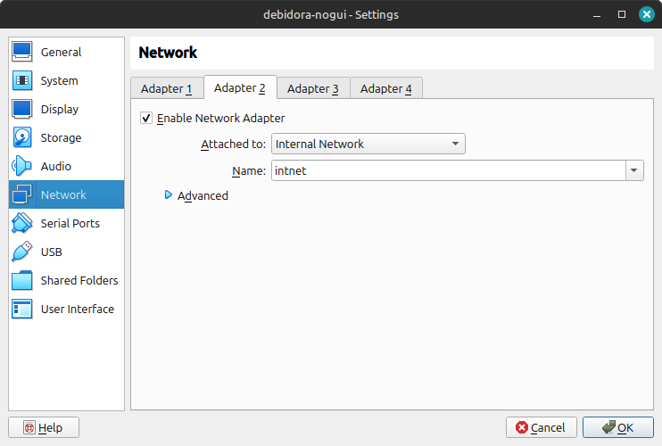

Adapter 2 disetting ke Internal Network agar bisa berkomunikasi langsung dengan VM2 tanpa akses ke luar. Adapter ini membentuk jaringan lokal antar VM di dalam VirtualBox.

### [Opsional] Akses SSH ke VM melalui NAT dengan Port Forwarding

Untuk akses VM dari host via SSH, gunakan perintah berikut:

```bash
ssh -p 2222 user@127.0.0.1
```

- `-p 2222`: Menentukan port 2222 pada host yang telah diforward ke port 22 (SSH) di VM.
- `user`: Ganti dengan username di dalam VM (Student jika menggunakan VM debian-nogui).
- `127.0.0.1`: Merupakan alamat localhost dari host karena koneksi dilakukan melalui port forwarding.

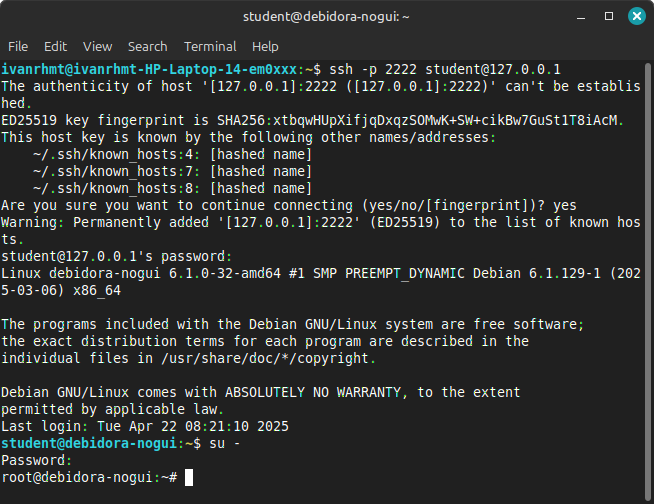

### [2] Konfigurasi IP pada VM1 (Adapter 2)

Untuk mengatur IP statis pada Adapter 2 (Internal Network) di VM1, buka file konfigurasi jaringan dengan perintah berikut:

```bash
sudo nano /etc/network/interfaces
```

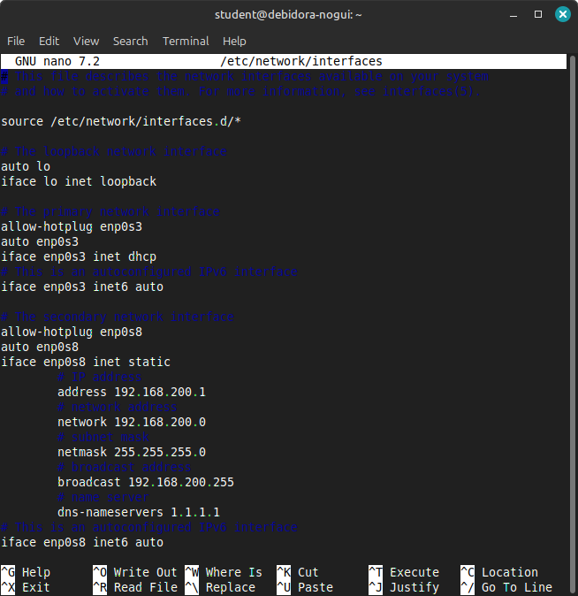

### [3] Konfigurasi Router/Gateway dengan IP Forwarding

#### Mengaktifkan IP Forwarding

Langkah pertama adalah mengaktifkan IP forwarding agar perangkat dapat mengalihkan lalu lintas jaringan antara dua antarmuka jaringan.

Buka file konfigurasi `sysctl.conf`:

```bash
nano -w /etc/sysctl.conf
```

Cari baris yang berisi `net.ipv4.ip_forward=1`. Jika baris tersebut ada tetapi diberi tanda komentar (#), hilangkan tanda komentar (#) di depan baris tersebut agar menjadi seperti ini:

```bash
net.ipv4.ip_forward=1
```

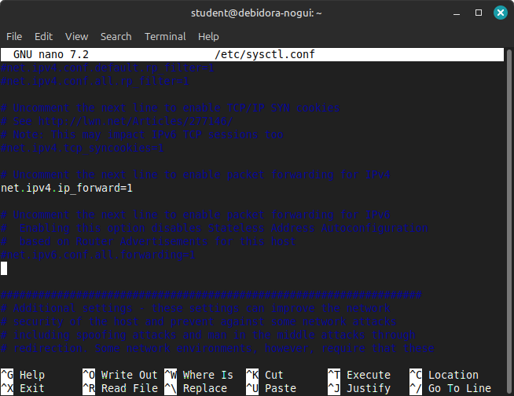

#### Menginstal dan Mengonfigurasi Iptables

Setelah IP forwarding aktif, langkah selanjutnya adalah mengatur NAT dan firewall menggunakan iptables.

Install `iptables-persistent` untuk menyimpan aturan iptables agar tetap berlaku setelah reboot:

```bash
apt-get -y install iptables-persistent
```

Kemudian, edit file konfigurasi iptables:

```bash
nano -w /etc/iptables/rules.v4
```

Tambahkan konfigurasi berikut sebagai contoh pengaturan NAT dan firewall:

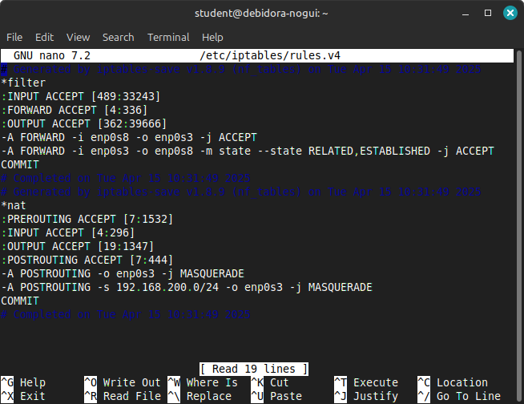

#### Mengaktifkan Aturan Iptables

Agar aturan iptables langsung aktif, jalankan perintah:

```bash
iptables-restore < /etc/iptables/rules.v4
```

#### Reboot dan Verifikasi

Reboot sistem untuk memastikan semua pengaturan diterapkan. Setelah reboot, periksa konektivitas jaringan untuk memastikan bahwa sistem sudah berfungsi sebagai router/gateway dengan benar.

### [4] Konfigurasi DNS

Instalasi bind9 menggunakan perintah berikut:

```bash
apt -y install bind9 bind9utils
```

Konfigurasi `named.conf`:

```bash
nano /etc/bind/named.conf
```

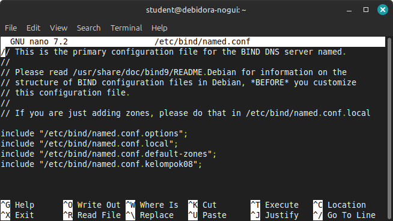

File ini akan digunakan untuk mendefinisikan zona-zona DNS buatan sendiri.

Konfigurasi `named.conf.options`:

```bash
nano /etc/bind/named.conf.options
```

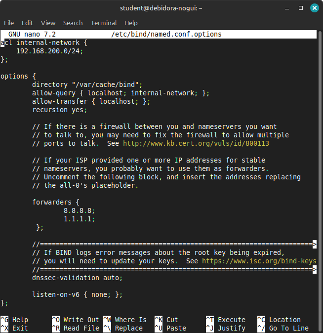

Tujuan konfigurasi ini adalah agar DNS server hanya melayani query lokal dan tidak bertindak sebagai resolver internet.

Menambahkan Zona di `named.conf.kelompok08`:

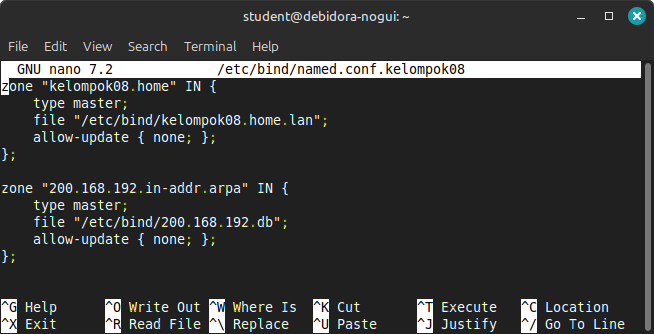

Zona `kelompok08.home` digunakan untuk menerjemahkan nama domain ke IP (forward lookup), sedangkan zona `200.168.192.in-addr.arpa` digunakan untuk menerjemahkan IP ke nama domain (reverse lookup). Keduanya bertipe master dan tidak mengizinkan update dinamis.

Konfigurasi agar hanya menggunakan IPv4:

```bash
nano /etc/default/named
```

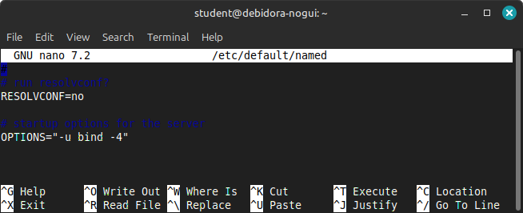

Perintah ini memaksa BIND hanya mendengarkan di protokol IPv4, bukan IPv6.

## Konfigurasi VM2

### [1] Konfigurasi network VM2

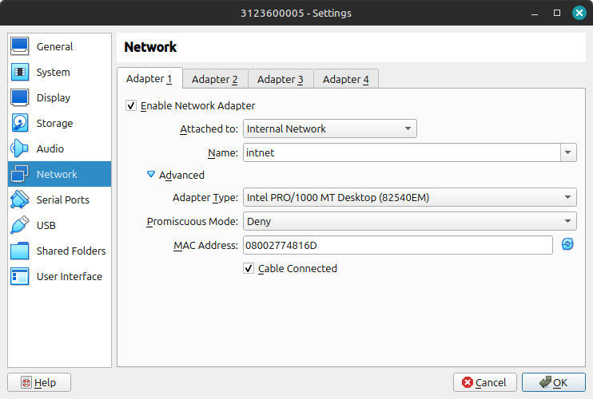

Pada VM2 hanya menggunakan 1 adapter yaitu Internal Network agar VM2 bisa berkomunikasi langsung dengan VM1 dalam jaringan lokal. Karena hanya menggunakan internal network, VM2 tidak memiliki akses langsung ke internet. Akses ke internet akan dilakukan melalui VM1 sebagai gateway.
