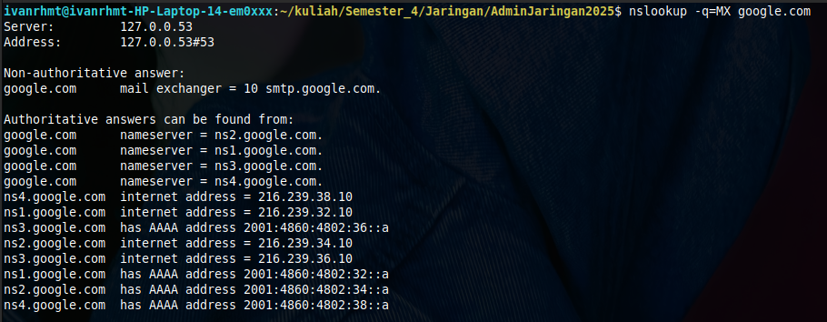
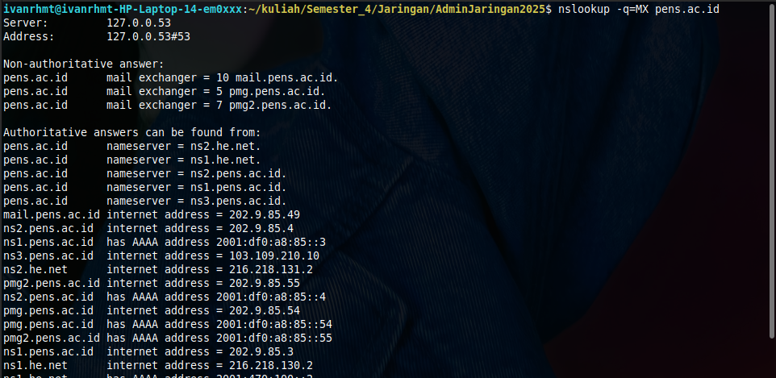

# Ringkasan Mail Server dan Protokol Email

### 1. Protokol Utama dalam Sistem Email

Sistem email bekerja dengan bantuan beberapa protokol untuk mengirim dan mengambil pesan. Protokol utama yang digunakan:

- **SMTP** (Simple Mail Transfer Protocol): Untuk mengirim email.

- **POP3** (Post Office Protocol v3): Untuk mengambil email dari server ke client.

- **IMAP** (Internet Message Access Protocol): Untuk mengelola email langsung di server.

- **POP3**S: Versi aman dari POP3 dengan enkripsi SSL/TLS.

**Perbandingan Ringkas**

| Protokol | Fungsi                 | Port Umum      | Enkripsi | Sinkronisasi | Cocok untuk                |
| -------- | ---------------------- | -------------- | -------- | ------------ | -------------------------- |
| SMTP     | Kirim email            | 25 / 465 / 587 | Opsional | Tidak        | Pengiriman email           |
| POP3     | Ambil email            | 110            | Tidak    | Tidak        | Akses dari satu perangkat  |
| POP3S    | Ambil email aman       | 995            | Ya       | Tidak        | Akses aman jaringan publik |
| IMAP     | Kelola email di server | 143 / 993      | Ya       | Ya           | Akses multi perangkat      |

### 2. Fungsi DNS MX Record

DNS `MX` (Mail Exchange) Record menentukan ke mana email untuk domain tertentu harus dikirim.

**Cek MX Record dengan `nslookup`**

- `google.com`

  

  Domain `google.com` memiliki satu mail exchanger, yaitu `smtp.google.com` dengan prioritas 10. Data yang ditampilkan merupakan non-authoritative answer, artinya berasal dari cache DNS.

- `pens.ac.id`

  

  Domain `pens.ac.id` memiliki tiga mail exchanger, yaitu `mail.pens.ac.id`, `pmg.pens.ac.id`, dan `pmg2.pens.ac.id` dengan prioritas berbeda (5, 7, dan 10). Semakin kecil angkanya, semakin diprioritaskan untuk pengiriman email.

### 3. Komponen Sistem Email

- **Alamat Email**: Format identitas pengguna, misalnya `user@domain.com`

- **Email Client**: Aplikasi seperti Gmail/Outlook untuk membaca & mengirim email.

- **Mail Server**: Server tempat penyimpanan dan pengiriman email.

- **User Agent (UA)**: Antarmuka pengguna untuk akses email.

- **MTA (Message Transfer Agent)**: Pengirim pesan antar server, memakai SMTP.

- **Mailbox**: Lokasi penyimpanan email masuk.

- **Spool File**: Menyimpan email keluar sementara sebelum dikirim.

### 4. Proses Pengiriman dan Penerimaan Email

1. Pengguna menyusun dan mengirim email via email client.

2. Email disimpan sementara di Spool File.

3. Alias Expander memeriksa alamat dan meneruskan ke MTA Client.

4. Email dikirim ke MTA Server penerima melalui internet.

5. MTA penerima memproses alamat dan menyimpan pesan di Mailbox penerima.

6. Penerima membaca email melalui User Agent.
